# DataSecure Standalone – Produkt- und Einführungsarchitektur

Stand: 05.10.2026 · einschließlich DS-104 bis DS-109 · Steuerung über BL-010.9

## Produktabgrenzung

DS-109 bestätigt die vorhandenen Schichten statt eines MVC-Neubaus:
Renderer projizieren Zustand und senden gebundene Aktionen; der
Standalone-Anwendungsdienst orchestriert Aufnahme, Lauf und Fortsetzung;
reine Coreverträge besitzen Semantik und geschlossene Fehlerkataloge; Tauri
und native Supervisoren besitzen Fenster-, Prozess- und OS-Zielverantwortung.
Das native Öffnen einer Identität prüft den erweiterten DTO geschlossen,
trennt dessen Warnung und reduziert anschließend auf den vierfeldrigen
Dateizielvertrag. Dokumentnummern stammen aus Backend-Kandidatenmitgliedschaft.
Verlaufspolling behält unveränderte Aktionsknoten und entwertet Antworten
gelöschter/geänderter Zeilen. Diese Struktur verbessert Zustandsklarheit,
ohne Coworks Adapter oder eine zweite Privacy-Engine einzuführen.

Das laufweite Identitätsdokument ist separat größenbegrenzt und gestreamt;
Originalwerte bleiben vertraulich und dauerhaft lokal. Fehler bei seiner
Ergebnisordnerkopie erhalten eine Warnung, auch wenn die private Datei noch
geöffnet werden kann. Lokale OS-Metadaten werden nur nach enger Strukturprüfung
ausgelassen und namentlich gemeldet. Startberichte und
`--startup-diagnostics` benötigen keine erfolgreiche WebView-Initialisierung;
OS-Blockaden vor Prozessstart benötigen weiterhin externe Betriebssystemevidenz.

DataSecure Standalone ist ein **eigenständiges zweites Endnutzerprodukt**. Es
funktioniert ohne Claude, Cowork, Skills, MCP, Agenten, Chat, Internetzugang und
vom Anwender installierte Node-/Python-Runtimes. Das vorhandene Claude-Plugin
bleibt ein separates Produkt.

**Verbindliches Zielbild:** Beide Produkte verwenden denselben neutralen
DataSecure-Core: sichere Aufnahme, versiegelte Arbeitskopie, Format- und
Coverage-Gates, Parser/Konverter, Journal/Fortsetzung, Mapping, Export und
inhaltsfreie Diagnose. Im Anonymisierungszweck kommen Content-Graph,
PII-Erkennung, Residual-Gate und erforderlichenfalls Sammelreview hinzu. Es
gibt keine zweite Anonymisierungslogik. Der Ziel-Core kennt weder Claude noch
MCP, Skills, Handoff-Capabilities oder Chat-Paging.

**Belegter Engineering-Iststand:** Standalone verwendet bereits dieselben
Engine-Module und Policies. Sieben neutrale Coreverträge sind direkt in beide
Produktprojektionen gebunden. BL-010.23 belegt zusätzlich den unterstützten
Anonymisierungsumfang produktgleich; weitere Entkopplung wird nur aus einem
konkreten Defekt abgeleitet und nicht als abstrakter Umbau fortgeführt.

RC109 extrahiert als ersten geprüften Schnitt `core/batch-next-action.js`,
`core/conversion-worker-contract.js` und `core/document-result-grade.js`.
Die bisherigen Importpfade sind reine Reexports. Fingerprint und semantische
Goldenläufe binden echte Plugin-/Standalone-Projektionen an identische gemeinsame
Policybytes. TXT/Markdown/CSV/DOCX, fünf Profile, Review, Abbruch und Fortsetzung
in einem frischen Prozess sind abgedeckt. Das ändert kein Journalformat und keine
bestehende Pseudonymbindung. Nachweise: `test-core-contracts.mjs` und
`test-core-policy-binding.mjs`; letzterer läuft im vollständigen Produktprofil.

Standalone besitzt mit `SecureDataMsg-Standalone` einen nicht mit dem
Pluginroot überlappenden Daten-, Konfigurations-, Journal-, Review- und
Export-Namespace. Ein im Standalone-Produkt erzeugter Stapel kann deshalb
nicht versehentlich als Claude-Handoff-Kandidat erscheinen. Ein globaler
Ressourcen-Lock darf beide Produkte vor gleichzeitiger Überlastung schützen,
ohne ihre Fachdaten zu vermischen.

## Ziel-Nutzerreise

Dieser Ablauf ist im Quellstand angebunden; seine Endnutzerfreigabe bleibt offen.
Die native Windows-Hülle ist als Engineering-Pilot vorhanden; native
Drag-and-drop-Aufnahme ist angebunden, eine freie Pausefunktion bleibt Zielumfang.
Sichtbare Drop-/Fokus- und macOS-Evidenz ist
nicht durch den Windows-Code- und Pakettest ersetzt.

Der Einstieg bleibt gemäß DS-086 immer **Start**; gespeicherte Ergebnisse und
unterbrochene Stapel wechseln die Ansicht nicht automatisch. Beide Funktionen
werden kurz erklärt. Es gibt keine vorbelegte Betriebsart.

1. Die gewünschte Funktion ausdrücklich wählen.
2. Bei Anonymisierung die Ergebnisbenennung wählen: neutral (Standard) oder
   Originalname mit `-anonymisiert`.
3. Dateien, einen Ordner oder per Drag-and-drop Quellen auswählen.
4. Die kurze Stapelzusammenfassung mit **Starten** verarbeiten.

Das Hauptfenster zeigt dabei lokal den aktuellen Quellenordner, die gewählten
Dateinamen und den Ergebnisordner. Diese Anzeige ist kein Diagnoseinhalt und
wird ausschließlich als Text gerendert. Die Betriebsart **Nur in Markdown
umwandeln** ist gemäß DS-082/DS-085 eine gleichwertige zweite Kernfunktion, im
Engineering-Piloten aktiviert, mit weiterhin offener Zielhostabnahme. Sie besitzt denselben
   Aufnahme-/Start-/Fortschritts-/Recovery-/Exportablauf, erhält aber alle
extrahierbaren Ausgangsinhalte ohne PII-Ersetzung. Nicht anonymisierte Konvertate
gehen ausschließlich nach `DataSecure-Markdown/Lauf-…`, niemals in den
anonymisierten Ergebnisweg oder die Plugin-Handoff-Liste. Der Modus gehört in
den dauerhaften Stapel- und Exportvertrag, nicht nur in einen UI-Schalter.

Die Navigation **Start / Verarbeiten / Verlauf** ist unabhängig vom
Verarbeitungszustand. **Verlauf** zeigt die 20 neuesten eigenen Läufe mit
jeweils laufgebundenen Ergebnis-/Zuordnungs- und Fortsetzungsaktionen. Der
Backendzustand wird vor jeder Aktion erneut geprüft; Fortsetzung übernimmt
keine Betriebsart aus der aktuellen Eingabemaske. Die Anzeigegrenze entfernt
keine Exporte. Innerhalb dieser Navigation bestehen folgende Arbeitszustände:

Ein alter Anonymisierungslauf ist nur fortsetzbar, wenn sein gespeicherter
Pseudonym-/Policykontext zur aktuellen Engine passt. Andernfalls bleibt er als
fehlgeschlagener Historieneintrag sichtbar und verlangt eine neue Auswahl; er
blockiert weder Funktionswahl noch Picker oder Drag-and-drop. Eine reine
Konvertierung und bereits veröffentlichte Export-/Zuordnungsschuld benötigen
keine erneute Privacy-Ausführung und bleiben unabhängig reparierbar. Der
Fortsetzen-Klick meldet nur die Workerannahme und liest danach den dauerhaften
Laufstatus neu.

1. **Auswahl:** `Dateien auswählen`, `Ordner auswählen`, Drag-and-drop,
   vor `Starten` weitere Dateien oder Ordner atomar ergänzen und doppelte
   Pfade überspringen, einzelne Dateien entfernen oder die gesamte
   **Auswahl leeren**. Nach `Starten` ist der Stapel unveränderlich.
2. **Verarbeitung:** nichtmodaler, inhaltsfreier Fortschritt mit
   `abgeschlossen/ausgewählt`; ein Dateifehler stoppt nicht den übrigen Stapel.
   Eine Pause bleibt außerhalb der Istzusage, bis Befehl und Recovery belegt sind.
3. **Prüfung:** nur im Anonymisierungszweck und erst nach Abschluss offener
   automatischer Arbeit; echte Mehrdeutigkeiten gesammelt in einer Liste mit
   `Anonymisieren`, `Beibehalten`, `Für gleiche Treffer übernehmen` und
   `Später`. Vertagen beendet nur den aktuellen Prüftermin: Der Lauf bleibt
   als **Prüfung offen** in seiner Verlaufszeile und kann dort nach Neustart
   oder nach anderen Läufen bewusst fortgesetzt werden. Ungeprüfte Dateien
   erhalten kein freigegebenes Ergebnis.
4. **Ergebnis:** nichtmodaler Status in der aktuellen Ansicht. Auf bewussten
   Wechsel in den Verlauf folgen `Ergebnisse öffnen`, bei Anonymisierung
   `Zuordnung anzeigen` und `Fortsetzen` je Zeile beziehungsweise
   `Neue Aufgabe wählen`. Reine Konvertierung behält den Quellbasisnamen und
   deaktiviert die nicht benötigte Zuordnungsaktion.

Bei einer Ordnerauswahl trägt der private Admissionvertrag den sicheren
Wurzel-relativen Pfad jeder Datei durch Journal und Export. Der sichtbare Lauf
spiegelt diese Unterordner. Anonymisierte Dateien heißen dort je Stapelwahl
`Dokument-NNN-anonymisiert.md` oder `<Basisname>-anonymisiert.md`; reine
Konvertate heißen `<Basisname>.md`. Die Zuordnung
des Anonymisierungslaufs nennt auf beiden Seiten genau diese relativen Pfade.
Absolute Quellpfade und der gewählte Wurzelordner werden nicht persistiert oder
diagnostisch ausgegeben. Der Export legt jedes Zielsegment einzeln an und prüft
es gegen Traversal, Links und ausgetauschte Verzeichnisse (DS-089).
Die Namenswahl wird im eigenen v6-Journal vor der Verarbeitung gebunden und
kann bei Fortsetzung nicht wechseln. Vorhandene Läufe werden nicht migriert;
Cowork bleibt stets neutral und flach.

Anonymisierungsprofile werden pro Datei automatisch erkannt; Format- und
Quellenprüfung gelten für beide Zwecke. Parsernamen, MarkItDown,
Sicherheitsgates und interne Pfade erfordern keine Benutzereinstellung.
Passwortgeschützte Dateien werden
unverändert übersprungen und im Abschluss verständlich genannt.

Standard-Ergebnisstamm ist `Dokumente/SecureDataMsg`; darunter liegen je nach
Zweck `DataSecure-Markdown/Lauf-…` oder `DataSecure-Output/Lauf-…`. Eine andere Wahl
ist freiwillig unter **Einstellungen → Ergebnisordner** möglich und wird lokal
gespeichert. Quellen werden niemals verändert, verschoben oder gelöscht.

## Komponenten und Produktgrenzen

Im Diagramm sind Plugin und gemeinsamer Core der vorhandene Ausgangspunkt.
Die Standalone-Application-Schicht und eine reale Tauri-Desktop-Hülle sind als
Engineering-Vertikalschnitt vorhanden. Rust-Hülle, Windows-Mehrfachpicker,
privater Core-Sidecar und inhaltsfreie UI-Projektion laufen auf Windows x64;
ein selbsttragendes Windows-x64-Engineering-Paket besteht die Paket- und
isolierte Startprüfung. Ad-hoc signierte App-Bundles sind auf macOS Intel und
Apple Silicon nativ gebaut, geprüft und über App→private IPC→Core gestartet.
Reproduzierbare Engineering-ZIPs sind für beide Architekturen gebaut, entpackt
und aus dem Paket erneut gestartet. Linux x64 besitzt eine native Tauri-/
AppImage-Projektion mit gebündelter Runtime, POSIX-Supervisor und eigener
Paket-/Startprüfung. Endnutzerfreigabe sowie sichtbare macOS-/Linux-UAT bleiben
offen. Der produktive Node-Konverter mit
PDF-/OCR-Komponenten ist bereits angebunden; MarkItDown gehört nicht dazu.

```mermaid
flowchart LR
  subgraph P[Produkt 1: Claude-/Cowork-Plugin]
    SKILL[Skills] --> MCP[MCP-Adapter]
  end
  subgraph S[Produkt 2: DataSecure Standalone]
    UI[Tauri-Desktop-UI Windows E0] --> SA[Standalone-Adapter E0]
    CLI[technische Support-CLI E0] --> SA
  end
  MCP --> CORE[DataSecure Application/Core API]
  SA --> CORE
  CORE --> INTAKE[Admission + versiegelter Snapshot]
  INTAKE --> MODE{gespeicherter Produktzweck}
  MODE -->|anonymisieren: direkte Formate| DIRECT[DataSecure-Parser]
  MODE -->|DOCX oder breite Standalone-Quelle| CONV[über neutralen Extraktionsvertrag zum Node-/OOXML-/PDF-/OCR-Konverter]
  MODE -->|nur Markdown: Standalone| CONV
  CONV --> COVERAGE{neutrale Coverage}
  COVERAGE -->|gültig + nichtleer und anonymisieren| GRAPH
  COVERAGE -->|unbekannt, leer oder unsicher| STOP[sicherer Einzelstopp]
  COVERAGE -->|nur Markdown| PLAIN[DataSecure-Markdown: Originalinhalte + Coveragehinweise]
  DIRECT --> GRAPH[Content Graph]
  GRAPH --> PII[PII-Erkennung + Residual-Gate]
  PII -->|Entscheidung offen und automatische Arbeit fertig| REVIEW[lokaler Sammelreview]
  PII -->|eindeutig| EXPORT[DataSecure-Output: anonymisierte MD]
  REVIEW --> EXPORT
  EXPORT --> MAP[Standalone: laufbezogene Zuordnung vor sichtbarem Abschluss]
```

Standalone verwendet **kein MCP und kein JSON-RPC**. Die Desktop-Hülle und die
optionale Support-CLI rufen die neutrale Application API direkt auf. Der
aktuelle E0-Unterbau erfüllt diese Trennung bereits: der frühere RPC-Prototyp
wurde verworfen, und ein eigener `standalone`-Datenroot wird vor dem Laden der
Engine festgelegt.

Nach DS-097 bedeutet diese Produkttrennung weder eine zweite Kopie des Privacy-
Kerns noch dauerhafte Windows-/macOS-Entwicklungsbranches. Ein gemeinsamer
Quellbaum speist getrennte Produktpakete und Zieljobs. Commitgleichheit gilt
innerhalb derselben Produkt-Releasekampagne; Cowork und Standalone dürfen
unabhängige veröffentlichte Stände behalten. Cowork-/Standalone- sowie
Windows-/macOS-/Linux-Varianten liegen ausschließlich in schmalen Adaptern;
gemeinsame Verarbeitung gehört unter die neutrale Processing-API.

Die Endnutzerpakete sind getrennt: Standalone enthält kein Pluginmanifest,
keine Skills, keine Prompts und keine Claude-/MCP-Laufzeit. Es erhält ein
eigenes Manifest, Runtime-Evidence, SBOM, Update- und Rollbackregeln. Die
gemeinsame Core-/Policy-Fingerprint-Bindung des Anonymisierungsmodus bleibt
ein Freigabegate nach BL-010.23; unterschiedliche v1-/v2-Kennungen werden
inhaltlich statt bytegleich verglichen.

Tauri 2 ist nach dem Technologiegegencheck der verbindliche Engineering-
Kandidat für die Desktop-Hülle. Die implementierte Rust-Schicht öffnet den nativen
Datei- oder Ordnerdialog und startet den zielgebunden mitgelieferten
DataSecure-Core als Sidecar. Der Haupt-Renderer verwendet nur das geschlossene UI-View-Model aus
`server/standalone/ui-contract.json`; er sieht ausschließlich die für den
Anwender bestimmte lokale Textanzeige von Auswahl und Ziel, niemals Rohbytes,
Mapping oder private Core-Verzeichnisse. Das getrennte Reviewfenster darf
nur während einer aktiven lokalen Prüfsitzung den benötigten Rohtext sehen.
Diese Anzeige wird nicht protokolliert
und besitzt keinen Netzwerkkanal. Die einzige produktive Zustandsquelle ist der
inhaltsfreie, kombinierte `get_public_state`-Snapshot; der Renderer fragt ihn
sequenziell und ohne überlappende Polls ab. Frühere, nicht angebundene
Event-/Reducer-Prototypen wurden entfernt. Zwischen Hülle und Core sind über
`desktop-ipc.js` nur höchstens 1 MiB große, längengeführte Nachrichten auf
exklusiv geerbten Prozesskanälen zulässig, niemals ein lokaler HTTP- oder
WebSocket-Port. Der eigene Aufnahmeevent liefert keine zusätzliche rohe
Drop-Pfadliste; die bestätigte lokale Auswahlprojektion mit Namen und
Quellenordnern darf als Text im Renderer erscheinen. Tauri erzeugt auch native
Framework-Dropevents mit Pfaden; der DataSecure-Renderer abonniert ausschließlich
seinen eigenen Aufnahmeevent. Es entstehen keine Rohbytes, direkten Dateirechte
oder Netzwerkrechte. Drop und Picker verwenden denselben Admissionvertrag;
ein nativer Guard serialisiert Auswahl, Aufnahme und Start. Ein Drop ersetzt
keinen gerade vorbereiteten oder laufenden Stapel. Fehlversuche liefern einen
sichtbaren, inhaltsfreien Hinweis und keine implizite Startfreigabe.

### DS-104: Review innerhalb von Standalone, nicht im Cowork-Adapter

Dies ist **RC157-Iststand**, aber kein RC151-Bestandteil. RC151 bediente den
Review durch einen separaten plattformspezifischen Dialogprozess. RC157 hat für
BL-010.44 ein eigenes, kurzlebiges App-Reviewfenster mit eng begrenztem
Inhaltsrecht. Nativ geladene Prüfseite und Sitzungsskript sind auf Windows,
beiden Macs und Linux belegt; die sichtbare Windows-Funktionsabnahme ist bestanden.
Der bisherige Haupt-Renderer bleibt bei seiner inhaltsfreien
Statusprojektion; Reviewtext gelangt weder in seine allgemeine Navigation
noch in Verlauf, Diagnose oder Eventlogs. Das Reviewfenster besitzt keine
Datei-, Shell-, Netz-, MCP- oder Cowork-Berechtigung. Es öffnet sich aus
**Jetzt prüfen** direkt an der aktuellen Laufkarte oder aus der genauen
Verlaufszeile; wenn die automatische Verarbeitung fertig ist, bleibt
dieser nächste Schritt sichtbar, auch falls das Fenster nicht in den
Vordergrund gelangt. Schließen bedeutet nicht Freigabe.

Mehrere Prüfgruppen desselben Laufs erscheinen nacheinander im selben
App-Prüffenster; eine neue Gruppe ist kein neuer Lauf. Falls nach einer
bestätigten Gruppe erst durch die erneute Core-Prüfung weitere Fundstellen
entstehen, zeigt das offene Fenster zunächst einen Wartehinweis und bietet
anschließend **Weitere Prüfung fortsetzen** für genau diesen Lauf an. Diese
Aktion ist nur im berechtigungsarmen Prüffenster verfügbar; sie verwendet
keinen globalen „letzten Lauf“ und gibt keine ungeprüften Ergebnisse frei.
Nach bestätigtem
terminalem Laufstatus schließt das Fenster automatisch. Während einer
Wartephase gibt es zusätzlich **Prüffenster schließen**; eine zu diesem
Zeitpunkt noch offene Entscheidung wird dadurch nur vertagt, nie freigegeben.
Die Abschlussfeststellung kommt aus dem privaten Core-Zustand und erst nach
dem letzten Review, nicht schon aus der Annahme einer einzelnen Entscheidung.

Die Review-Sitzung wird nur für den genauen Standalone-Lauf, die versiegelte
Quellgeneration, die Policyversion und die aktuell offenen Fundstellen
ausgegeben. Der erste Adapter vermittelt maximal 40 MiB flüchtigen Draft in
128-KiB-Abschnitten über eine eigene Tauri-Capability und nimmt Entscheidungen
entgegen. Die bestehende allgemeine 1-MiB-IPC-Grenze wird nicht erhöht;
unbegrenzte Rohtextnachrichten oder ein lokaler HTTP-Port sind kein Ersatz.
Der Core validiert jede Fundstellen-ID, Textposition, Gruppenreichweite und
Abschlussfreigabe erneut. Eine UI-Antwort allein veröffentlicht nichts.

Die Reviewansicht nennt **Dokument N von M**, **Fundstelle X von Y** und den
exakten aktiven Text unmittelbar bei den Entscheidungsschaltflächen.
Quellkontext und anonymisierte Vorschau stehen lesbar nebeneinander, bei
schmalem Fenster untereinander; nur die aktive Stelle ist hervorgehoben.
Entscheidungen für exakt gleiche Stellen zeigen ihre Anzahl/Reichweite.
Rückgängig und **Später entscheiden** bleiben erreichbar, Freigabe erst nach
vollständig validierten Entscheidungen. Der Hauptlauf heißt währenddessen
**Prüfung offen** und bietet in seiner Laufkarte **Jetzt prüfen**, das den
aktuellen verbundenen Lauf fortsetzt und das Prüffenster direkt öffnet.
Nach Verbindungsneustart gibt es dabei keinen Rückfall auf einen beliebigen
historischen Lauf. Für eine verschobene Prüfung bietet der Verlauf bei
derselben Laufkennung **Prüfung fortsetzen**. Automatisch fertiggestellte Dateien werden nicht
noch einmal verarbeitet; die offenen werden nicht als anonymisierte
Ergebnisse ausgegeben. Mac- und Linux-Reviewer des Cowork-Plugins bleiben
eigene Produktadapter. Die gemeinsame Engine und ihr Review-Ergebnisvertrag
werden nicht für einen Desktop-Sonderfall aufgeweicht.

### DS-106: Entitätstyp und laufweite Wiederverwendung (lokaler Entwicklungsstand)

Nur Standalone setzt `allowOrganizationReview` im internen Reviewvertrag.
Die lokale Seite bietet Person, Unternehmen und Beibehalten; die typisierte
Unternehmensantwort geht bis zur ORG-Registry und dem Identitätssnapshot.
Credential-Entscheidungen und Coworks eigener Adapter werden nicht erweitert.

`gateway/standalone-review-choices.js` persistiert eine begrenzte, authentifizierte
Tabelle im privaten Laufjournal. Vollständige normalisierte Schreibweisen werden
mit HMAC statt Klartext gebunden: Laufkennung, Seed, Vertrags-/Regelversion und
Policy-Fingerprint gehören zur Bindung. Vor Wiederverwendung werden aktuelle
Quell-/Ausgabespans geprüft. Das Zusammenführen einer neuen Prüfgruppe erhält
alle ursprünglichen Kandidaten für die vollständige Freigabebindung; kein
bekannter Text wird pauschal zur Ausnahme der Restprüfung. Nach Änderung der
Registry werden vertagte Standalone-Drafts frisch rekonstruiert, nicht anhand
veralteter Offsets fortgeschrieben. Neue Läufe und fertige Ausgaben bleiben
getrennt. Bereits bestätigte Entscheidungen gelten für offene und folgende
Prüfungen des Laufs, auch nach Neustart.

Das Hauptfenster darf ausschließlich laufgebundene Fehler-Metadaten durch
`get_run_failures` lesen: Dateiname/Endung, fester Fehlercode und feste
Handlungserklärung, kein Dokumentinhalt. Ein erneuter Listenaufruf startet
keinen Batch und erteilt keine Reviewfreigabe.

Die Standalone-Konverter halten Grafikhinweise und konservative PDF-/OCR-
Geometrie in eigenen Modulen (`markdown-visuals.js`, `pdf-text-layout.js`).
Keine externen Bildbeschreibungen, keine semantische Löschung beliebiger
OCR-Wörter; ohne sichere Geometrie bleibt OCR erhalten.

### BL-050.6: Kontaktprüfung vor der Privacy-Analyse (06.10.2026, unveröffentlicht)

Der Konverter liefert für übernommene PDF-/Bild-OCR-Kontakte eine geschlossene
Spannenkarte mit Seite und Zeile. Der Orchestrator ruft ausschließlich im
Standalone-Kanal vor Personenreservierung und Ersetzung den privaten
`prepareOcrContacts`-Hook auf. In der ersten automatischen Phase bleibt eine
solche Datei vertagt; die integrierte Prüfseite bestätigt oder korrigiert die
exakten Stellen und geht anschließend im selben Fenster zur Entitätsprüfung.
Reine Konvertierung bleibt unverändert. Kontaktbestätigung ist keine Ausnahme
vom normalen PII-/Residual-Gate.

`core/ocr-contact-review.js` enthält nur transportneutrale Spannen-/Antwort-
Validierung. `gateway/ocr-contact-store.js` speichert komplette atomare private
Entscheidungen, authentifiziert gegen Lauf/Seed, Snapshot, ganze Extraktion,
Policy, Vertrag und Fundstellen. Capture und Publication prüfen dieselbe
Bindung erneut; Journal und Hauptansicht enthalten keine Korrektur-Rohwerte.
Der tatsächliche Desktop-Frame-Decoder prüft die geschlossenen Aktionsformen,
der Broker zusätzlich die Berechtigung seines aktuell gebundenen Entwurfs.
400 Kontaktstellen mit je höchstens 256 Korrekturzeichen und 900 KiB Antwort
bleiben unter dem bestehenden IPC-Budget. Cowork erhält keinen zusätzlichen
Hook, keine GUI-Abhängigkeit und keine PDF-/Bildfreigabe. Der
[Reviewvertrag](contracts/BATCH_REVIEW_V2.md) beschreibt Verschieben, Wiederaufnahme
und die getrennten Testnachweise; neue Mac-/Releasepakettests bleiben offen.

### DS-107: geprüfte Desktop-Verbindungen und Fehlerzustände (05.10.2026, unveröffentlicht)

Die typisierte Unternehmensentscheidung wird auch vom tatsächlichen privaten
Frame-Decoder akzeptiert; der Broker prüft weiterhin die ausdrückliche
Freigabeberechtigung des besitzenden Drafts. Eine echte Sidecar-/Worker-
Integration belegt Fehler vor dem ersten Draft, laufgebundene Wiederaufnahme,
Unternehmenspublikation, ungültige Antwort sowie Vertagen/Fortsetzen. Das ist
kein Ersatz für den vollständigen nativen Bedienlauf auf einem Mac.

Standalone verwendet auf allen Plattformen ein Dialogbudget von 5.000
Fundstellen und 40 MiB Draftdaten, mit Antworten unter der 1-MiB-Framegrenze.
Prüfgruppen werden begrenzt; ein einzelnes größeres Dokument erhält einen
konkreten Hinweis zum Aufteilen statt einer wiederholten identischen Prüfung.
Coworks externe Adapter und deren eigene Grenzen bleiben unverändert.

Die Prüfsitzung bindet bereits den Workerstart an die Laufkennung. Vorbereitung,
Bereitschaft, Publikation, technische Fehler, Wiederaufnahme und ausstehende
Ergebnisbereitstellung sind getrennte Zustände. Ein fehlgeschlagener Worker
darf keinen endlosen Arbeitsindikator darstellen. Die UI nennt sichere
Fehlercodes, nächste Schritte und die für diese Prüfung vorgemerkten Dateien;
ein Prozessstartfehler bedeutet nicht, dass diese Dokumente beschädigt sind.

Rust begrenzt Request-Lock, Prozessstart, Pipe-Schreiben und Antwort gemeinsam
auf 30 Sekunden. Der Pipe-Writer läuft getrennt; die unabhängige Child-Control
unterbricht ihn beim Schließen. Das native Hauptfenster nutzt dieselbe
Schließbehandlung wie der isolierte Smoke, ohne auf den Request-Mutex zu warten.
Die Kindprozessbeendigung wird begrenzt geprüft; fehlende Bestätigung erhält
einen festen Diagnosecode, nicht eine unbegrenzte GUI-Warteoperation.

Dateidetails enthalten nur lokale Basenames/relative Labels mit Endung und
festen Ursachen. Gestoppte Dateien mit ausstehender Zuordnung bleiben sichtbar;
noch nicht gestartete Dateien stehen getrennt. Diagnoseprotokolle erhalten
keine Labels, Rohtexte oder OS-Fehlermeldungen. Ein verweigerter Zugriff wird
nicht automatisch einem Virenscanner oder Gatekeeper zugeschrieben.

Native Smokes verlangen eine erfolgreiche `get_review_session`-Antwort, nicht
nur Seitenladen oder Requeststart. Plattformfremde Konverterfälle sind explizite
Skips. Browser-/Textverträge bleiben als solche gekennzeichnet. Ein neuer
Engineering-Build kann in einem frischen eigenen Verzeichnis entstehen, ohne
das gespeicherte Releasepaket zu überschreiben.

### DS-105: getrennte vertrauliche Identitätszuordnung

Der Standalone-Adapter erfasst vor der anonymisierten Publikation nur die
typisierten, im fertigen Markdown tatsächlich verwendeten eindeutigen
Pseudonyme samt erkanntem Originalwert. Pro Lauf und Datei liegt ein privater
Snapshot im App-Datenbereich; nach freigegebenen Ergebnissen entsteht daraus
eine vertrauliche menschliche TXT-Datei. Private Einzelsnapshots bleiben im
App-Datenbereich; nur die lesbare TXT wird einmalig in
`VERTRAULICH-NICHT-HOCHLADEN` innerhalb des gebundenen Lauf-Ergebnisordners
publiziert. Der Laufordner als Ganzes ist daher **nicht KI-uploadfähig**.
Eine manuell entfernte sichtbare Kopie wird nicht still wiederhergestellt.
Die inhaltsfreie Verlaufsprojektion enthält lediglich Verfügbarkeit;
der private Host öffnet die exakte Datei zum gewählten Lauf. Andere Produkte
erhalten keine Rohwertschnittstelle. Nicht rückführbare Sammelmasken,
fehlende Snapshots und typisierte Pseudonyme ohne eindeutigen Ursprung sind
ausdrücklich keine vollständige Identitätszuordnung.

Es gibt auf Nutzerwunsch **keinen TTL- oder Startup-Löschpfad** für diese
Zuordnung. Sie bleibt nach Ablauf der Arbeitsjournale erhalten; die App
bietet keinen Löschbutton. Eine etwaige Löschung ist eine manuelle
Betriebssystemaktion. Da der Verlauf nur 20 Läufe zeigt, öffnet eine separate
Einstellungsaktion den privaten Zuordnungsordner im Betriebssystem; die
inhaltsfreie Hauptansicht erhält auch dabei keine Originalwerte. Der lokale
Zugriff folgt dem Betriebssystemkonto; zusätzliche
Verschlüsselung und Zielhost-/Backup-Verhalten sind vor Freigabe noch zu
prüfen. Dieser lokale Implementierungsstand ist nicht Teil von RC151.

### Zweiter Modus: Konvertierung ohne Anonymisierung (implementierter Ablauf)

BL-010.28 bindet die vollständige Nutzerreise beider Modi. Der bereits vorhandene
lokale Parserpfad wird wiederverwendet, wo seine Extraktions-Coverage reicht;
BL-010.15–19 ist mit dem gebündelten Node-/PDF-/OCR-Konvertierungspfad verbunden.
Die [Produkt-/Zweckmatrix](TARGET_ARCHITECTURE.md#aktuelle-fähigkeiten-nach-produkt-und-zweck)
und [Formatmatrix](../FORMAT_COVERAGE_MATRIX.md) bestimmen den aktiven Umfang.
Der Konvertierungszweig verwendet seinen eigenen Inhaltserhaltungs- und
Artefaktvertrag und umgeht nicht bloß ein Residual-Gate im Anonymisierungsexport.
DS-087/090 ergänzt davor für DOCX und breite Quellen einen neutralen
Extraktionsvertrag ohne Zweck oder
Publikationskennung. Im Anonymisierungszweck wird dieses Ergebnis nur im Speicher
an den vorhandenen Privacy-Core übergeben und niemals als rohes `dm_`-Artefakt
veröffentlicht. `complete` und `incomplete` bleiben Zustände der Quellenextraktion;
beide dürfen mit vertraglich gültigem, nichtleerem Markdown diese Grenze
passieren. Der davon unabhängige Anonymisierungsgrad wird erst aus PII-, Review-
und Residualsignalen abgeleitet. Ergebnis und Manifest sagen daher nie aus, dass
ausgelassene Bestandteile des ursprünglichen Containers anonymisiert wurden.
Unbekannte Coverage, leere OCR sowie beschädigte, verschlüsselte oder aktive
Quellen stoppen weiterhin laufbezogen.
Auswahl und Quellen bleiben unverändert; in der Modusübersicht steht ruhig und
dauerhaft **Nicht anonymisiert – enthält Originalinhalte**. Bei einem Fehler
bleiben fertige Positionen checkpointgebunden erhalten; Fortsetzen nutzt denselben
Modus, Zielordner und Mappingkontext. PII-Review entfällt in diesem Modus.
Extraktionshinweise werden mit lesbaren Ergebnissen gespeichert; fehlerhafte
Dateien erscheinen in Abschluss und inhaltsfreier Diagnose. Reine Konvertierung
erzeugt keine Zuordnung; bei Anonymisierung enthält sie ausschließlich
tatsächlich veröffentlichte Ergebnisse. Es entsteht kein neuer
Bestätigungsdialog. Der v5-Zweckvertrag unterscheidet sich ausdrücklich von
alten Anonymisierungsjournals. Eigene Worker-Nachrichtentypen verhindern,
dass ein alter Worker Konvertierung irrtümlich als Anonymisierung startet.
TXT/Markdown/CSV/DOCX/XLSX/PPTX, Text-/Scan-PDF und PNG/JPEG/BMP laufen im
gebündelten Konvertierungsworker. PDF.js, lokale DE/EN-Tesseract-Modelle und
Canvas werden mit normalem Node ausgeliefert; kein System-Python oder Netzwerk.
Der Pakettest prüft beide Betriebsarten mit tatsächlicher Prozessübergabe,
unveränderten Quellen und exakten Zuordnungs-/Ergebniszielen.

Empfangs-ACK, erster dauerhafter Checkpoint und terminaler Export sind getrennte
Ereignisse. Fortsetzung bindet den beobachteten oder ausdrücklich ausgewählten
Lauf, auch wenn ein neuerer Verlaufseintrag existiert. Die gemeinsame
`batch-next-action.js`-Readiness startet Review nur ohne verbleibende,
verarbeitende, wiederholbare, Delivery- oder Mappingpositionen; unbekannte
Zähler belegen keine Bereitschaft. Unterbrochene Mischstapel laufen zuerst im
Batchworker weiter und wechseln erst danach automatisch in den Sammelreview.
Der Fortschritt zählt freigegebene plus terminal gestoppte Positionen;
Ergebnis- und Fehlerzahlen bleiben getrennt.

Die gemeinsame, kanalgebundene Persistenz liegt in
`gateway/standalone-history-store.js`: rohtextfreie Zusammenfassungen und
ursprüngliche Verzeichnisbindungen. Die Schreibfunktionen bleiben außerhalb
des Standalonekanals wirkungslos. `standalone/run-history.js` enthält nur die
20er-Verlaufsprojektion und deren lokale Aktionen. Das Cowork-Paket erhält den
Core-Store als transitive Journal-/Exportabhängigkeit, niemals den Desktop-
Verlaufsadapter. Die echte Produktdateiprojektion prüft diese Modulgrenze auch
ohne eine installierte Anwendung.

Der Renderer bestätigt einen terminalen Zustand erst nach zwei aufeinander
folgenden `requestAnimationFrame`-Takten über den ausschließlich dafür
zugelassenen Befehl `ack_terminal_presented`. Dieses inhaltsfreie ACK trennt
„Core fertig“ von „im Fenster tatsächlich gerendert“. Eine nur pro ausstehender
Darstellung gültige, inhaltsfreie Generationsnummer bindet das ACK exakt an den
angezeigten Zustand und die konkrete Laufkennung; ein verspätetes ACK kann
keinen späteren Stapel bestätigen. Bleibt es aus, bestätigt die Hülle keine
Darstellung und protokolliert den festen Timeout. Standalone delegiert die
Anzeige an seine Produkt-UI und öffnet keinen automatischen nativen
Abschlussdialog. Vorbereitung und laufender Fortschritt bleiben passiv im
selben Fenster; es entsteht kein weiterer Bestätigungsdialog.

Der Windows-Engineering-Spike einschließlich selbsttragendem Pilotpaket ist
erfolgreich; die Produktfreigabe erfolgt erst
nach den begrenzten Zielsystem-Spikes auf allen zugesagten Plattformen.
Verbindliche Messwerte sind Kaltstart p50 höchstens 1,5 Sekunden und p95
höchstens 2,5 Sekunden auf der Referenzhardware, höchstens 20 MiB zusätzliche
Hüllengröße ohne Core, Tastatur-/Screenreader-Zugänglichkeit, nativer
Mehrfachpicker, sicherer Abbruch sowie Update und Rollback. Die Wahl ändert den
gemeinsamen Core und seine Sicherheitsgates nicht.

Der aktuelle Stand umfasst vier getrennte Pakete: Windows x64, macOS Intel,
macOS Apple Silicon und Linux x64 glibc. Die beiden macOS-Artefakte werden auf macOS gebaut
und jeweils nativ getestet; ein Universal-Binary ist zunächst kein Ziel. Eine
Developer-ID-Signatur oder Notarisierung ist keine Produktpflicht. Die
zertifikatsfreien Piloten verwenden aber ausdrücklich Tauri-Ad-hoc-Signierung
(`signingIdentity: "-"`); die verbleibende Gatekeeper-Bedienung muss im macOS-UAT
sichtbar und dokumentiert sein. Wegen
der gebündelten Node-22.23.2-Core-Runtime ist für beide Mac-Pakete mindestens macOS
13.5 fest vorgegeben. Der maschinenlesbare Ziel- und Sidecarvertrag liegt in
`apps/datasecure-standalone/desktop-targets.json`; die Pilotanleitung in
`apps/datasecure-standalone/MACOS-START.md`.

Tauri selbst sowie Rust sind Buildabhängigkeiten. Anwender installieren weder
Rust noch Node, Python, MarkItDown oder eine Tauri-Laufzeit separat; sie starten
nur das selbsttragende DataSecure-Paket. Eine Cloud-Webapp ist kein Ersatz,
weil sie Originale hochladen würde. Eine reine Browser-/WASM-Neuentwicklung ist
nicht Teil des Produkts, da sie Dateisystem, Recovery, Konverter und OCR erneut
implementieren müsste.

## MarkItDown-Vertrauensgrenze

Microsoft MarkItDown `0.1.7` mit Python `>=3.10` (MIT) ist ausschließlich ein
optionales DOCX-Differentialorakel für Engineering. Der bestehende
`converters/markitdown/runtime-contract.json` setzt `product_enabled: false`.
`differential-oracle.js` und `bridge.py` sind keine produktiven Worker und
werden nicht als erforderliche Anwender-Runtime gebündelt. Die frühere
Erlaubnis aus DS-075 ist keine Behauptung einer solchen Produktintegration.

Der begrenzte Orakelvertrag bleibt erhalten:

- expliziter Engineering-Aufruf mit synthetischen zugelassenen Snapshot-Bytes;
- Eingabe über geerbtes `stdin`, private Markdown-Ausgabe über `stdout`;
  dieser ungerahmte Engineeringtransport ist kein produktiver IPC-Nachweis;
- `enable_builtins=False`, `enable_plugins=False`, nur explizit erlaubte
  Formatkonverter;
- keine URL-/Pfad-Konvertierung, kein Netzwerk und keine LLM-Clients;
- `markitdown-ocr` wird nicht eingebunden;
- keine sichtbaren Rohmarkdown-Zwischenartefakte des Orakels.

Der produktive Konverter verwendet bereits Node-/OOXML-Parser, PDF.js, Canvas
und Tesseract-DE/EN. Neue Format- oder Zweckfreigaben brauchen weiterhin eigene
Coverage-, Ressourcen-, Offline-, Paket- und Zielsystemnachweise. Ein positives
MarkItDown-Differentialergebnis allein ist niemals Freigabeevidenz.

## Diagnosevertrag

Das gemeinsame Core-Journal enthält ausschließlich geschlossene Ereignisse wie
`operation_started`, `snapshot_sealed`, `converter_started`,
`coverage_checked`, `review_deferred` und `result_published`. Erlaubt sind nur
zufällige Lauf-/Itemkennungen, `product_channel`, Formatklasse, feste
Versionen, begrenzte Zähler, Dauer und feste Fehlercodes.

Standalone ergänzt ausschließlich UI-Aktionen aus einer geschlossenen Liste,
Picker-Start/-Ende, Fortschritt, Review und Ergebnisöffnung. Eine spätere
Pause erhält erst mit implementiertem Befehl und Recovery-Test einen Eventtyp.
MCP-/Toolereignisse gehören nur zum Pluginprotokoll. Verboten sind in allen Diagnosejournalen:
Rohtext, Markdown-/OCR-Inhalt, Namen, Pfade, Mappinginhalt, Dokumenthash,
Kommandozeile, Environment, freie Exceptions, Tracebacks und fremdes
stdout/stderr. Das Mapping ist eine lokale Fachdatei, kein Log.

## Lieferreihenfolge

Der explizite App-Review gilt auch für genau eine mehrdeutige Datei. Der
automatische Analysepfad vertagt sie unabhängig von der Stapelgröße; nur die
bewusst gestartete, laufgebundene Prüfsitzung verarbeitet die Entscheidung.
Coworks vorhandener Einzelreview bleibt von diesem Standalone-Kanalcheck
unverändert. Native macOS-/Linux-Paketsmokes verlangen zusätzlich die geladene
integrierte Prüfseite und ihren privaten Sitzungsaufruf.

Die direkte Service-/CLI-Schicht, physische Namespace-Trennung, Tauri-Hülle,
native Auswahl/Drop, beide Zwecke, Konvertierungsworker, Fortschritt und
laufgebundene Historie sind bereits implementiert. Die weitere Reihenfolge
führt diesen Stand zur Freigabe:

1. Verbleibende neutrale Core-API-Extraktion und gemeinsame semantische
   Fingerprint-/Golden-Bindung der Anonymisierung schließen (BL-010.9/BL-010.23).
2. Beide bestehenden Zweckpfade mit Parser-, Fremderzeuger-, Negativ-,
   Offline-, Abbruch-/Fortsetzungs-, Review- und Exportregressionen sichern.
   MarkItDown bleibt dafür ein optionales Orakel, keine Lieferabhängigkeit.
3. Einen neuen sauberen Kandidaten in selbsttragende, zielgebundene
   Node-/PDF-/OCR-Pakete projizieren; Lizenz-/SBOM-Prüfung, reproduzierbare
   Paketprüfung und native Windows-/macOS-/Linux-Builds getrennt nachweisen.
4. Aktuelle Fresh-Install-, Tastatur-/Screenreader-, Drop-/Fokus-, Ergebnis-
   Öffnungs-, Update-/Rollback- und Zielhost-UATs durchführen; erst danach
   die jeweilige Produktfreigabe erteilen.

Aktueller E0-Stand: Die direkte lokale Service-/CLI-Schicht, ein eigener
Standalone-Datenroot und der produktive Node-/OOXML-/PDF-/OCR-Konverter
sind implementiert und automatisiert getestet. Der deaktivierte MarkItDown-
Orakelvertrag ist zusätzliche Engineering-Infrastruktur. Zielkatalog, Tauri-Konfiguration,
Renderer-Berechtigungsgrenze und macOS-Pilotablauf sind maschinenprüfbare
Verträge. Die reale Rust-Hülle, ein nativer Picker mit bewusstem Nachtrag vor Start und der
private längengerahmte Core-Dispatcher wurden auf Windows x64 kompiliert und
gestartet. Ein Ready-Handshake und endliche Aktionsfristen (30 Sekunden;
Quellenaufnahme nach DS-108 fünf Minuten mit echten Zeit-Heartbeats)
begrenzen wartende UI-Aufrufe. Ein unbekannt lange im OS blockierter Spawn
wird beim Shutdown außerhalb der GUI weiter reconciliiert, niemals als
erfolgreich beendet ausgegeben. Das Windows-x64-Pilot-ZIP bindet
die herkunftsgeprüfte Node-Runtime und eine frisch erzeugte geschlossene
Coreprojektion; Paketprüfung und isolierter Sidecar-Smoke sind grün. Der Build
ist ein technischer Vertikalschnitt, **noch kein freigegebenes
Endnutzerprodukt**. Native App-/IPC-/Paket-E0 ist auf macOS Intel/Apple Silicon
und Linux x64 belegt; eine gegebenenfalls organisatorische Lizenzfreigabe und
sichtbare Zielsystem-UAT bleiben offen. Auch vorhandene
grüne Paketnachweise ersetzen keinen Nachweis
für einen erst danach geänderten Kandidaten.
