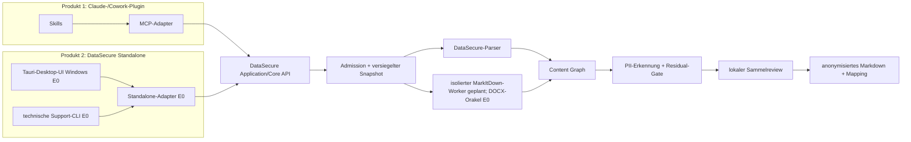

# DataSecure Standalone – Produkt- und Einführungsarchitektur

Stand: 04.09.2026 · Entscheidungen DS-075/DS-076 · Steuerung über BL-010.9

## Produktabgrenzung

DataSecure Standalone ist ein **eigenständiges zweites Endnutzerprodukt**. Es
funktioniert ohne Claude, Cowork, Skills, MCP, Agenten, Chat, Internetzugang und
vom Anwender installierte Node-/Python-Runtimes. Das vorhandene Claude-Plugin
bleibt ein separates Produkt.

**Verbindliches Zielbild:** Beide Produkte verwenden denselben neutralen
DataSecure-Core: sichere Aufnahme, versiegelte Arbeitskopie, Format- und
Coverage-Gates, Parser/Konverter, Content-Graph, PII-Erkennung, Residual-Gate,
Sammelreview, Journal/Fortsetzung, Mapping, Export und inhaltsfreie Diagnose. Es
gibt keine zweite Anonymisierungslogik. Der Ziel-Core kennt weder Claude noch
MCP, Skills, Handoff-Capabilities oder Chat-Paging.

**Belegter Engineering-Iststand:** Standalone verwendet bereits dieselben
Engine-Module und Policies, bindet sie aber noch teilweise über eine aus dem
Plugin-Kontext entstandene Kompositionsschicht. Die vollständige Extraktion der
neutralen Application-/Core-API sowie ein gemeinsamer Core-/Policy-Fingerprint
für beide Produktpakete bleiben BL-010.9 und BL-010.23. Bis diese Gates grün
sind, ist „derselbe Core“ ein verbindliches Ziel und keine vollständige
Entkopplungszusage.

Standalone besitzt mit `SecureDataMsg-Standalone` einen nicht mit dem
Pluginroot überlappenden Daten-, Konfigurations-, Journal-, Review- und
Export-Namespace. Ein im Standalone-Produkt erzeugter Stapel kann deshalb
nicht versehentlich als Claude-Handoff-Kandidat erscheinen. Ein globaler
Ressourcen-Lock darf beide Produkte vor gleichzeitiger Überlastung schützen,
ohne ihre Fachdaten zu vermischen.

## Ziel-Nutzerreise

Dieser Ablauf beschreibt das freizugebende Ziel. Die native Windows-Hülle ist
als Engineering-Pilot vorhanden; Drag-and-drop und echtes Pausieren sind noch
Zielumfang und dürfen in der Pilotoberfläche nicht als verfügbar erscheinen.

Im Erfolgsfall gibt es genau zwei bewusste Handlungen:

1. Dateien, einen Ordner oder per Drag-and-drop Quellen auswählen.
2. Die kurze Stapelzusammenfassung mit **Anonymisieren** starten.

Die Oberfläche besteht aus vier Zuständen im selben Fenster:

1. **Auswahl:** `Dateien auswählen`, `Ordner auswählen`, Drag-and-drop und
   `Letzte Ergebnisse öffnen`.
2. **Verarbeitung:** nichtmodaler Fortschritt; ein Dateifehler stoppt nicht den
   übrigen Stapel. Der Anwender kann sicher pausieren.
3. **Prüfung:** nur echte Mehrdeutigkeiten, gesammelt in einer Liste mit
   `Anonymisieren`, `Beibehalten`, `Für gleiche Treffer übernehmen` und
   `Später`.
4. **Ergebnis:** verständliche Zähler sowie `Ergebnisse öffnen`, `Zuordnung
   öffnen` und `Neuer Stapel`.

Profile und Dokumenttypen werden pro Datei automatisch erkannt. Parsernamen,
MarkItDown, Sicherheitsgates, technische Fehlercodes, Bildmodus und interne
Pfade erscheinen nicht im Normalablauf. Passwortgeschützte Dateien werden
unverändert übersprungen und im Abschluss verständlich genannt.

Standardziel ist `Dokumente/SecureDataMsg/DataSecure-Output`. Eine andere Wahl
ist freiwillig unter **Einstellungen → Ergebnisordner** möglich und wird lokal
gespeichert. Quellen werden niemals verändert, verschoben oder gelöscht.

## Komponenten und Produktgrenzen

Im Diagramm sind Plugin und gemeinsamer Core der vorhandene Ausgangspunkt.
Die Standalone-Application-Schicht und eine reale Tauri-Desktop-Hülle sind als
Engineering-Vertikalschnitt vorhanden. Rust-Hülle, Windows-Mehrfachpicker,
privater Core-Sidecar und inhaltsfreie UI-Projektion laufen auf Windows x64;
ein selbsttragendes Windows-x64-Engineering-Paket besteht die Paket- und
isolierte Startprüfung. Endnutzerfreigabe, native macOS-Zielhostnachweise und
der produktive MarkItDown-Worker bleiben offen.

Standalone verwendet **kein MCP und kein JSON-RPC**. Die Desktop-Hülle und die
optionale Support-CLI rufen die neutrale Application API direkt auf. Der
aktuelle E0-Unterbau erfüllt diese Trennung bereits: der frühere RPC-Prototyp
wurde verworfen, und ein eigener `standalone`-Datenroot wird vor dem Laden der
Engine festgelegt.

Die Endnutzerpakete sind getrennt: Standalone enthält kein Pluginmanifest,
keine Skills, keine Prompts und keine Claude-/MCP-Laufzeit. Es erhält ein
eigenes Manifest, Runtime-Evidence, SBOM, Update- und Rollbackregeln. Beide
Produkte binden denselben Core- und Policy-Fingerprint.

Tauri 2 ist nach dem Technologiegegencheck der verbindliche Engineering-
Kandidat für die Desktop-Hülle. Im Ziel öffnet die Rust-Schicht den nativen
Datei- oder Ordnerdialog und startet den zielgebunden mitgelieferten
DataSecure-Core als Sidecar. Der Renderer verwendet dann nur das geschlossene UI-View-Model aus
`server/standalone/ui-contract.json`; er sieht weder Quellpfade noch Rohbytes,
Mapping oder private Core-Verzeichnisse. `ui-state.js` definiert die einzige
sichtbare Zustandsfolge, und `ui-projection.js` projiziert interne Vorgänge auf
eine feste, inhaltsfreie Feldliste. Zwischen Hülle und Core sind über
`desktop-ipc.js` nur höchstens 1 MiB große, längengeführte Nachrichten auf
exklusiv geerbten Prozesskanälen zulässig, niemals ein lokaler HTTP- oder
WebSocket-Port. Quellpfade existieren nur im privaten Hülle-Core-Kanal und nie
in einem Rendererereignis.

Der Windows-Engineering-Spike einschließlich selbsttragendem Pilotpaket ist
erfolgreich; die Produktfreigabe erfolgt erst
nach den begrenzten Zielsystem-Spikes auf allen zugesagten Plattformen.
Verbindliche Messwerte sind Kaltstart p50 höchstens 1,5 Sekunden und p95
höchstens 2,5 Sekunden auf der Referenzhardware, höchstens 20 MiB zusätzliche
Hüllengröße ohne Core, Tastatur-/Screenreader-Zugänglichkeit, nativer
Mehrfachpicker, sicherer Abbruch sowie Update und Rollback. Die Wahl ändert den
gemeinsamen Core und seine Sicherheitsgates nicht.

Vier getrennte Pakete sind vorgesehen: Windows x64, macOS Intel, macOS Apple
Silicon und Linux x64 glibc. Die beiden macOS-Artefakte werden auf macOS gebaut
und jeweils nativ getestet; ein Universal-Binary ist zunächst kein Ziel. Eine
Signatur oder Notarisierung ist keine Produktpflicht, aber die daraus folgende
Gatekeeper-Bedienung muss im macOS-UAT sichtbar und dokumentiert sein. Wegen
der gebündelten Node-24-Core-Runtime ist für beide Mac-Pakete mindestens macOS
13.5 fest vorgegeben. Der maschinenlesbare Ziel- und Sidecarvertrag liegt in
`apps/datasecure-standalone/desktop-targets.json`; die Pilotanleitung in
`apps/datasecure-standalone/MACOS-START.md`.

Tauri selbst sowie Rust sind Buildabhängigkeiten. Anwender installieren weder
Rust noch Node, Python, MarkItDown oder eine Tauri-Laufzeit separat; sie starten
nur das selbsttragende DataSecure-Paket. Eine Cloud-Webapp ist kein Ersatz,
weil sie Originale hochladen würde. Eine reine Browser-/WASM-Neuentwicklung ist
nicht Teil des Produkts, da sie Dateisystem, Recovery, Konverter und OCR erneut
implementieren müsste.

## MarkItDown-Vertrauensgrenze

Microsoft MarkItDown ist ein Konverter, kein Anonymisierer und kein
Sicherheitsgate. Es läuft erst **nach** Formatprüfung und versiegeltem Snapshot
in einem getrennten, ressourcenbegrenzten Worker.

- exakt gepinnte Version `0.1.7`, Python `>=3.10`, MIT-Lizenz;
- keine Installation oder Downloads auf dem Endgerät;
- nur gebündelte, hashgebundene Wheels je Zielplattform;
- Eingabe ausschließlich als Snapshot-Bytes über geerbtes `stdin`;
- Ausgabe ausschließlich als private Markdown-Zeichenfolge über `stdout`;
- `enable_builtins=False`, `enable_plugins=False`, nur explizit erlaubte
  Formatkonverter;
- keine URL-/Pfad-Konvertierung, kein Netzwerk und keine LLM-Clients;
- `markitdown-ocr` wird nicht eingebunden;
- rohe Markdown-Konvertate werden weder gerendert noch als sichtbare Datei
  gespeichert; für Resume wird der versiegelte Snapshot neu konvertiert.

Die erste Stufe nutzt DOCX als Differentialorakel gegen den vorhandenen Parser.
XLSX, PPTX, Text-PDF, Scan-PDF und Bilder werden erst nach je eigenem Coverage-,
Ressourcen-, Offline-, Paket- und Zielsystemnachweis freigegeben. MarkItDown
allein ist niemals Freigabeevidenz.

## Diagnosevertrag

Das gemeinsame Core-Journal enthält ausschließlich geschlossene Ereignisse wie
`operation_started`, `snapshot_sealed`, `converter_started`,
`coverage_checked`, `review_deferred` und `result_published`. Erlaubt sind nur
zufällige Lauf-/Itemkennungen, `product_channel`, Formatklasse, feste
Versionen, begrenzte Zähler, Dauer und feste Fehlercodes.

Standalone ergänzt ausschließlich UI-Aktionen aus einer geschlossenen Liste,
Picker-Start/-Ende, Fortschritt, Review und Ergebnisöffnung. Eine spätere
Pause erhält erst mit implementiertem Befehl und Recovery-Test einen Eventtyp.
MCP-/Toolereignisse gehören nur zum Pluginprotokoll. Verboten sind in allen Diagnosejournalen:
Rohtext, Markdown-/OCR-Inhalt, Namen, Pfade, Mappinginhalt, Dokumenthash,
Kommandozeile, Environment, freie Exceptions, Tracebacks und fremdes
stdout/stderr. Das Mapping ist eine lokale Fachdatei, kein Log.

## Lieferreihenfolge

1. direkte Standalone-Application-API und physische Namespace-Trennung;
2. MarkItDown-Vertrag und DOCX-Differentialtests;
3. Tauri-2-Hülle mit Auswahl, Fortschritt, Sammelreview und Abschluss; Windows-
   Engineering-Build steht, native Spikes auf macOS Intel/ARM und Linux folgen;
4. hashgebundene Python-Runtime und isolierter Konverter-Supervisor je OS;
5. XLSX/PPTX, Text-PDF und zuletzt Scan-PDF/Bilder mit lokaler OCR;
6. vier getrennte Standalone-Pakete, Offline-/Golden-Korpus-Gates und
   Windows-/macOS-/Linux-UAT.

Aktueller E0-Stand: Die direkte lokale Service-/CLI-Schicht, ein eigener
Standalone-Datenroot, der MarkItDown-Vertrag und die DOCX-Engineering-Bridge
sind implementiert und automatisiert getestet. Zielkatalog, Tauri-Konfiguration,
Renderer-Berechtigungsgrenze und macOS-Pilotablauf sind maschinenprüfbare
Verträge. Die reale Rust-Hülle, ein nativer Picker ohne zweite Auswahl und der
private längengerahmte Core-Dispatcher wurden auf Windows x64 kompiliert und
gestartet. Ein Ready-Handshake und eine feste 30-Sekunden-Antwortgrenze
verhindern einen unendlich wartenden UI-Aufruf. Das Windows-x64-Pilot-ZIP bindet
die herkunftsgeprüfte Node-Runtime und eine frisch erzeugte geschlossene
Coreprojektion; Paketprüfung und isolierter Sidecar-Smoke sind grün. Der Build
ist ein technischer Vertikalschnitt, **noch kein freigegebenes
Endnutzerprodukt**. Produktiver Konverter, breite Formatfreigabe, native
macOS-/Linux-Pakete, Lizenzfreigabe und Zielsystem-UAT sind offen.
