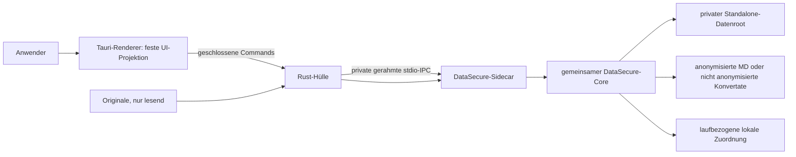

# DataSecure Standalone – Sicherheitsmodell

Stand: 07.09.2026 · Entscheidungen DS-075 bis DS-092

## Geltungsbereich

Dieses Dokument beschreibt ausschließlich das zweite Produkt **DataSecure
Standalone**. Es ist kein Modus des Claude-Plugins. Standalone benötigt weder
Claude, Cowork, MCP, Skills, Agenten noch Internet und verwendet den getrennten
Datenroot `SecureDataMsg-Standalone`.

## Vertrauensgrenzen

- Der Renderer zeigt nach DS-082 gewählte Quellenordner, Dateinamen und
  Ergebnisordner als lokale Textprojektion. Er erhält keine Rohbytes,
  Dokumenttexte, Mappinginhalte, Zugriffstokens, Kommandozeilen oder freien
  Exceptions und hat keinen direkten Datei-, Shell-, Dialog- oder Netzwerkzugriff.
  Opake Laufkennungen binden die erlaubten Historienaktionen an genau einen Lauf.
- Die Rust-Hülle öffnet native Datei-/Ordnerdialoge und nimmt native Drops an.
  Sie übergibt absolute Quellen über den privaten Prozesskanal an den Sidecar;
  Picker und Drop verwenden dieselbe Aufnahmeprüfung und starten allein nichts.
- Der Sidecar wird bei Bedarf gestartet. Sein Environment wird geleert und auf
  eine feste OS-/Locale-/DataSecure-Allowlist reduziert. Proxy-, Cloud-, API-
  und Agentenwerte werden nicht weitergegeben.
- Jede IPC-Nachricht ist längengerahmt und auf 1 MiB begrenzt. Timeout,
  Protokollfehler oder unerwartetes Prozessende verwerfen den Kanal und beenden
  den Sidecar; der nächste Aufruf startet eine neue Instanz.
- Es gibt keinen localhost-HTTP-/WebSocket-Listener und keinen Auto-Updater.

## Datenlebenszyklus

Originale werden nur lesend aufgenommen und niemals verändert, verschoben oder
automatisch gelöscht. Private Snapshots, Journale, Review- und Recoverydaten
liegen ausschließlich im Standalone-Datenroot. Der gespeicherte Stapelzweck
entscheidet über zwei getrennte Ausgabeverträge (DS-085):

- **Markdown und anonymisieren:** Nur nach Parser-, PII- und Residual-Gates sowie
  erforderlicher lokaler Entscheidung verifiziertes Markdown gelangt nach
  `DataSecure-Output/Lauf-…`.
- **Nur Markdown:** Die lokale Extraktion erhält Originalinhalte, führt keine
  PII-Ersetzung und keinen Anonymisierungsreview aus. `dm_`-Artefakte und
  `DataSecure-Markdown/Lauf-…` bleiben ausdrücklich **nicht anonymisiert**.
  Coverage-/OCR-Hinweise kennzeichnen begrenzte Extraktionen; kaputte oder
  geschützte Quellen erhalten kein Konvertat. Es entstehen keine Privacy-
  Lesecapabilities und keine Einträge im Plugin-Handoff.

Beide Zwecke veröffentlichen erst nach terminalem Gesamtstapel einen sichtbaren
Lauf. Nur die Anonymisierung ergänzt `DataSecure-Zuordnung.csv` (DS-083/DS-088).
Reine Konvertierung behält den Basisnamen und braucht keine zusätzliche Zuordnung.
Das dauerhafte globale Mapping bleibt im privaten Datenbereich. Die lokale Zuordnung ist kein
Diagnose-Log und wird nicht an das Claude-Produkt übergeben. Quellen, fertige
Exporte und Zuordnungen fallen nicht unter die 0–14-Tage-Aufbewahrung temporärer
Arbeits-/Reviewdaten.

Ein Fehler stoppt fail-closed. Fortsetzbare Stapel erscheinen als `stopped` und
`resumable`; die Oberfläche darf weder Erfolg noch einen neuen Stapel vortäuschen.
Offene Reviewpositionen öffnen erst dann die gemeinsame Prüfung, wenn keine
automatische Verarbeitung, wiederholbare Position, Delivery oder Mappingreparatur
mehr aussteht. Beide Produkte nutzen denselben Corevertrag; fehlende Zähler
belegen keine Reviewbereitschaft. Abgeschlossen zählt erfolgreiche und terminal
gestoppte Positionen; Fehler und verfügbare Ergebnisse bleiben separat sichtbar.

Die App startet gemäß DS-086 ohne vorausgewählte Betriebsart auf **Start**.
Ein Empfangs-ACK bestätigt nur die Workerübergabe, nicht den ersten dauerhaften
Checkpoint oder Abschluss. **Verlauf** zeigt höchstens 20 lokale Läufe; diese
Anzeigegrenze ist keine Löschfrist. Öffnen und Fortsetzen prüfen den konkreten
Lauf, seinen gespeicherten Zweck und sein ursprüngliches Ziel erneut. Abschluss
und Wiederherstellung öffnen keine Ergebnisse automatisch. Ein geänderter
Ergebnisstandard verändert keine früheren Öffnungsziele.

## Paket- und Supply-Chain-Grenze

Das Windows-x64-Engineering-Paket enthält Tauri-Hülle, gepinnte offizielle
Node-Runtime, eine beim Paketbau frisch erzeugte geschlossene Coreprojektion,
Manifest, Runtime-Evidence, SBOM, Lizenzhinweise und SHA-256. Anwender
installieren keine Rust-, Node- oder Python-Toolchain. Microsoft Edge WebView2
ist eine dokumentierte Systemvoraussetzung und wird nicht nachgeladen.
Der Konvertierungspfad verwendet die mitgelieferten Node-/OOXML-Parser, PDF.js,
Canvas und lokale Tesseract-DE/EN-Modelle. MarkItDown/Python ist nur ein
optionales Engineering-Differentialorakel und kein produktiver Konverter.

Das Engineering-SBOM inventarisiert Rust-Crates, setzt deren Lizenzfelder aber
noch auf `NOASSERTION`. Vor einem Endnutzerrelease ist eine komponentenweise
Lizenzprüfung Pflicht. Windows-UAT und native macOS-Intel-/ARM-Pakete samt UAT
sind ebenfalls noch offen. Bis dahin ist das Paket ein Engineering-Pilot.

## Nichtziele

- keine rechtssichere Anonymitäts- oder Zertifizierungszusage;
- keine Entschlüsselung passwortgeschützter Quellen;
- keine Cloud-, Remote- oder Browser-only-Verarbeitung;
- keine freie Pause-/Prozesssteuerung durch den Renderer; technische
  Unterbrechungen und vertagte Reviews bleiben über den Core fortsetzbar;
- keine Gleichsetzung der aktiven DOCX-/XLSX-/PPTX-/PDF-/Bildextraktion mit
  einer vollständigen Anonymisierung des Originalcontainers. Nach DS-087/090
  dürfen bekannte `complete`- und `incomplete`-Extraktionen mit gültigem,
  nichtleerem Markdown in den Privacy-Core; anonymisiert wird ausschließlich
  diese Markdown-Repräsentation. Unbekannte Coverage, Leertext sowie
  beschädigte, verschlüsselte oder aktive Quellen stoppen. Maßgeblich ist die
  [Formatmatrix](../FORMAT_COVERAGE_MATRIX.md).
