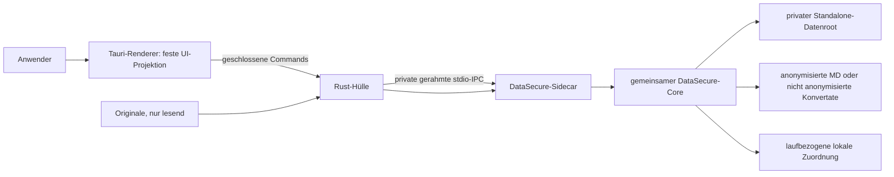

# DataSecure Standalone – Sicherheitsmodell

Stand: 06.10.2026 · einschließlich DS-104 bis DS-109

## Geltungsbereich

Dieses Dokument beschreibt ausschließlich das zweite Produkt **DataSecure
Standalone**. Es ist kein Modus des Claude-Plugins. Standalone benötigt weder
Claude, Cowork, MCP, Skills, Agenten noch Internet und verwendet den getrennten
Datenroot `SecureDataMsg-Standalone`.

## Vertrauensgrenzen

- Der Renderer zeigt nach DS-082 gewählte Quellenordner, Dateinamen und
  Ergebnisordner als lokale Textprojektion. Er erhält keine Rohbytes,
  Dokumenttexte, Mappinginhalte, Zugriffstokens, Kommandozeilen oder freien
  Exceptions und hat keinen direkten Datei-, Shell-, Dialog- oder Netzwerkzugriff.
  Opake Laufkennungen binden die erlaubten Historienaktionen an genau einen Lauf.
- Die Rust-Hülle öffnet native Datei-/Ordnerdialoge und nimmt native Drops an.
  Sie übergibt absolute Quellen über den privaten Prozesskanal an den Sidecar;
  Picker und Drop verwenden dieselbe Aufnahmeprüfung und starten allein nichts.
- Der Sidecar wird bei Bedarf gestartet. Sein Environment wird geleert und auf
  eine feste OS-/Locale-/DataSecure-Allowlist reduziert. Proxy-, Cloud-, API-
  und Agentenwerte werden nicht weitergegeben.
- Jede IPC-Nachricht ist längengerahmt und auf 1 MiB begrenzt. Timeout,
  Protokollfehler oder unerwartetes Prozessende verwerfen den Kanal und beenden
  den Sidecar; der nächste Aufruf startet eine neue Instanz.
- Es gibt keinen localhost-HTTP-/WebSocket-Listener und keinen Auto-Updater.

## Datenlebenszyklus

Originale werden nur lesend aufgenommen und niemals verändert, verschoben oder
automatisch gelöscht. Private Snapshots, Journale, Review- und Recoverydaten
liegen ausschließlich im Standalone-Datenroot. Der gespeicherte Stapelzweck
entscheidet über zwei getrennte Ausgabeverträge (DS-085):

- **Markdown und anonymisieren:** Nur nach Parser-, PII- und Residual-Gates sowie
  erforderlicher lokaler Entscheidung verifiziertes Markdown gelangt nach
  `DataSecure-Output/Lauf-…`.
- **Nur Markdown:** Die lokale Extraktion erhält Originalinhalte, führt keine
  PII-Ersetzung und keinen Anonymisierungsreview aus. `dm_`-Artefakte und
  `DataSecure-Markdown/Lauf-…` bleiben ausdrücklich **nicht anonymisiert**.
  Coverage-/OCR-Hinweise kennzeichnen begrenzte Extraktionen; kaputte oder
  geschützte Quellen erhalten kein Konvertat. Es entstehen keine Privacy-
  Lesecapabilities und keine Einträge im Plugin-Handoff.

Beide Zwecke veröffentlichen erst nach terminalem Gesamtstapel einen sichtbaren
Lauf. Nur die Anonymisierung ergänzt `DataSecure-Zuordnung.csv` (DS-083/DS-088).
Reine Konvertierung behält den Basisnamen und braucht keine zusätzliche Zuordnung.
Das dauerhafte globale Mapping bleibt im privaten Datenbereich. Die lokale Zuordnung ist kein
Diagnose-Log und wird nicht an das Claude-Produkt übergeben. Quellen, fertige
Exporte und Zuordnungen fallen nicht unter die 0–14-Tage-Aufbewahrung temporärer
Arbeits-/Reviewdaten.

Ein Fehler stoppt fail-closed. Fortsetzbare Stapel erscheinen als `stopped` und
`resumable`; die Oberfläche darf weder Erfolg noch einen neuen Stapel vortäuschen.
Offene Reviewpositionen öffnen erst dann die gemeinsame Prüfung, wenn keine
automatische Verarbeitung, wiederholbare Position, Delivery oder Mappingreparatur
mehr aussteht. Beide Produkte nutzen denselben Corevertrag; fehlende Zähler
belegen keine Reviewbereitschaft. Abgeschlossen zählt erfolgreiche und terminal
gestoppte Positionen; Fehler und verfügbare Ergebnisse bleiben separat sichtbar.

Die App startet gemäß DS-086 ohne vorausgewählte Betriebsart auf **Start**.
Ein Empfangs-ACK bestätigt nur die Workerübergabe, nicht den ersten dauerhaften
Checkpoint oder Abschluss. **Verlauf** zeigt höchstens 20 lokale Läufe; diese
Anzeigegrenze ist keine Löschfrist. Öffnen und Fortsetzen prüfen den konkreten
Lauf, seinen gespeicherten Zweck und sein ursprüngliches Ziel erneut. Abschluss
und Wiederherstellung öffnen keine Ergebnisse automatisch. Ein geänderter
Ergebnisstandard verändert keine früheren Öffnungsziele.

## DS-106: lokale Entitätsentscheidung und exakte Wiederverwendung

Die Standalone-Unternehmenswahl ist ein ausdrücklich gesetzter interner
Reviewvertrag, keine neue MCP-Aktion und keine allgemeine Core-Allowlist.
Person und Unternehmen erzeugen typverschiedene Registry-Einträge; Credential-
Fundstellen akzeptieren keine Unternehmenswahl. Original-/Ausgabespans,
vollständige Entscheidungsbindung und unabhängige Restprüfung bleiben vor jeder
Publikation erforderlich. Bereits ersetzte Platzhalter dürfen bei der Rest-
Fundstellensuche keine erfundenen Namen über ihre maskierten Leerstellen bilden.

Die private Entscheidungstabelle enthält höchstens 10.000 HMAC-gebundene
vollständige Schreibweisen ohne Rohwerte. Sie ist authentifiziert und an den
konkreten Lauf, seinen Seed, Vertrag, Regelversion und Policy-Fingerprint
gebunden. Manipulierte, widersprüchliche oder zu große Tabellen werden nicht
übernommen. Wiederverwendung gilt nur nach exakter aktueller Fundstellenprüfung
in offenen und folgenden Prüfphasen desselben Laufs, nicht für neue Läufe oder
fertige Dateien. Die Tabelle ist keine Verschlüsselungs- oder Anonymitätszusage.

Dateinamen in Fehlerlisten sind private lokale Metadaten. Der Renderer erhält
keine ungeprüften Pipeline-Fehlertexte oder Dokumentinhalte. Fehler der Anzeige,
Verarbeitung und Zielhostumgebung werden getrennt diagnostiziert; ein
Komplettausfall eines anderen Geräts wird nicht ohne dessen Diagnose einem
beobachteten Einzeldokumentfehler zugeschrieben.

Bei der Extraktion werden keine Grafikbedeutungen erfunden. Nur vollständig
unlesbare Symbolruns werden ausgelassen und gekennzeichnet. Bild-only-OCR und
unbekannte Geometrie bleiben erhalten; doppelte OCR-Wörter dürfen nur über
belegtem, beibehaltenem und sichtbar gerendertem nativem Text unterdrückt werden.
Veränderte Inhalte benötigen einen neuen überprüften Paketstand; die lokale
Implementierung gilt nicht als nachträglicher Nachweis für RC157.

## Vorangestellte OCR-Kontaktentscheidung (BL-050.6, unveröffentlicht)

Die bestehende vertrauliche Prüfseite kann übernommene PDF-/Bild-OCR-Kontakte
vor jeder Personenreservierung und Anonymisierung bestätigen oder ausdrücklich
korrigieren. Seite, OCR-Zeile und genaue UTF-16-Position kommen aus dem
Konvertervertrag; ein Kontaktwarncode ohne gültige nichtleere Spannenkarte wird
abgewiesen. Hohe OCR-Konfidenz und übereinstimmende Zusatzlesarten sind keine
Freigabe. Reine Markdown-Konvertierung erhält weiterhin die ursprüngliche
Extraktion mit Qualitätshinweis.

Maximal 400 Kontaktentscheidungen pro Dokument und 256 Zeichen pro Korrektur
halten die vollständige Antwort innerhalb von 900 KiB und damit des 1-MiB-
Transportbudgets. Der Broker akzeptiert diese Aktionen nur für seinen aktuell
gebundenen Kontaktentwurf, nicht für eine beliebige Entitätsprüfung. Bestätigte
Werte werden nicht von Ersetzungen oder Residual-Gates ausgenommen.

Atomare private `.ocrreview`-Dateien binden komplette Entscheidungen per HMAC an
Lauf/Seed, Quellen-Snapshot, vollständige aktuelle Extraktion, Policy, Vertrag
und exakte Kontaktspannen. Die Wiederaufnahme prüft diese Bindung und die
gehaltene Dateiintegrität erneut. Veränderungen stoppen mit
`OCR_CONTACT_REVIEW_INVALID` und einem festen Hinweis auf einen neuen Lauf.
Einträge enthalten gegebenenfalls Korrektur-Rohwerte und gehören ausschließlich
in den privaten Arbeitsbereich, nicht ins Journal, Diagnose, Ergebnisverzeichnis
oder die Hauptansicht. Ihre Aufbewahrung folgt temporären Arbeitsartefakten;
die bestehende dauerhafte Identitätszuordnung bleibt davon getrennt.

Bereinigung erlaubt nur eigene exakt benannte Dateien und nachgewiesene
unterbrochene atomare Hardlink-Paare. Das begrenzte Inventar von 600 Einträgen
deckt 200 Quellen, 200 Entscheidungen und 200 unterbrochene Tempdateien ab;
fremde Links, Unterordner oder veränderte Identität werden nicht gelöscht.
Dies ist keine Verschlüsselung oder Schutzgarantie gegen gleichberechtigte
Prozesse desselben Benutzers. Cowork erhält keine neue Kontakt-UI oder
Formatfreigabe. Details: [Reviewvertrag](contracts/BATCH_REVIEW_V2.md#standalone-erweiterung-ocr-kontakte-vor-der-anonymisierung-06102026-unveröffentlicht).

## Paket- und Supply-Chain-Grenze

DS-108 bindet die Frist von 30 Sekunden (Quellenaufnahme: 300 Sekunden) an die gesamte Desktop-Anfrage:
Kanalsperre, Prozessstart, Frame-Schreiben und Antwort. Ein gesonderter
Child-Control erlaubt das native Schließen unabhängig von dieser Sperre.
Die App wartet begrenzt auf das Ende ihres Sidecars und protokolliert eine
nicht bestätigte Beendigung als `STANDALONE_SHUTDOWN_FAILED`, nicht als Erfolg.
Sie beendet keine fremden Prozesse und gibt keine offenen Reviewdaten frei.

Aufnahmefehler dürfen über einen geschlossenen, größenbegrenzten privaten
Vertrag Dateilabels an die eigene Hauptansicht geben: relative Namen mit
Endungen und feste Ursachecodes, keine beliebigen Exceptions oder Inhalte.
Die vertrauliche Prüfseite kann bei Startfehlern ihre vorgemerkten Dateien
nennen. Dieselben Namen dürfen nicht in inhaltsfreie Diagnoseereignisse
gelangen. Fehlende Laufzeit, Ausführungsverweigerung und ungültige Architektur
werden getrennt; keine davon rechtfertigt pauschales Abschalten von
Betriebssystemschutz. Ein bestätigter Startfehler bleibt beim konkreten
Lauf und Startversuch, bis ein neuer Versuch bewusst gestartet wird.

Der gemeinsame Standalone-Prüfadapter begrenzt jeden Dialog auf 5.000
Fundstellen, 40 MiB flüchtigen Entwurf und maximal 1 MiB je IPC-Frame.
Diese Grenze ersetzt keine Entwurfsberechtigung oder unabhängige Restprüfung.
Zu große einzelne Dokumente werden erklärbar vertagt und müssen aufgeteilt
werden; eine automatische Freigabe ist ausdrücklich kein Fallback.

Das Windows-x64-Engineering-Paket enthält Tauri-Hülle, gepinnte offizielle
Node-Runtime, eine beim Paketbau frisch erzeugte geschlossene Coreprojektion,
Manifest, Runtime-Evidence, SBOM, Lizenzhinweise und SHA-256. Anwender
installieren keine Rust-, Node- oder Python-Toolchain. Microsoft Edge WebView2
ist eine dokumentierte Systemvoraussetzung und wird nicht nachgeladen.
Der Konvertierungspfad verwendet die mitgelieferten Node-/OOXML-Parser, PDF.js,
Canvas und lokale Tesseract-DE/EN-Modelle. MarkItDown/Python ist nur ein
optionales Engineering-Differentialorakel und kein produktiver Konverter.

Das Engineering-SBOM inventarisiert die 259 erreichbaren Nicht-Dev-Rust-Crates
komponentenweise und enthält kein `NOASSERTION`; die maschinelle Lizenzprüfung
ist E0 belegt. Eine gegebenenfalls organisatorisch verlangte menschliche
Lizenzfreigabe bleibt davon getrennt. Native ad-hoc signierte macOS-App-Bundles
sind auf Intel und Apple Silicon gebaut und über die private IPC-Grenze
gestartet. Reproduzierbare, manifest-/hash-/modusgeprüfte Engineering-ZIPs sind
für beide Architekturen gebaut und nach dem Entpacken erneut gestartet.
Der bestätigte Windows-Anwenderlauf von RC157 bleibt gültige begrenzte
Bedienevidenz. Der neue lokale DS-107-Engineering-Bau ist kein nachträglicher
Nachweis für dessen Bytes; neue native macOS-Bedienevidenz ist hier nicht
erbracht. Windows-Publisher-Signierung und macOS-Developer-ID/Notarisierung
benötigen Organisationszertifikate und bleiben von lokal bestandenen Tests
getrennt. Linux x64 besitzt ebenfalls eine gebündelte,
nativ gebaute und bis durch App → private IPC → Core gestartete AppImage-
Projektion; die sichtbare Linux-Zielhost-UAT ist noch offen. Bis dahin bleiben
die zusätzlichen Spezialabnahmen offen; frühere bestandene Anwenderläufe
werden dadurch nicht zurückgenommen.

## Zusätzliche Gegenprüfung DS-108

DS-108 verschärft die Marker-/Reviewgrenze: Großbuchstaben in eckigen Klammern
sind keine Datenschutzattestation. Die enge Ausgabemarkergrammatik wird bei aus
dem Original übernommenen variablen typisierten Labels (HMAC oder numerische
Kennnummern einschließlich `PERSON_REVIEW`) durch eine lokale,
positionsgebundene Herkunftsentscheidung ergänzt. Tatsächlich neu erzeugte
Marker bleiben geschützt. Gemischte und einspaltige Zugangsdatenzellen können
keinen unredigierten Rest durch einen vorgeschobenen Marker freigeben.
5.000 Fundstellen gelten in der gesamten Standalone-Kette, nicht nur im Dialog;
Cowork behält seinen eigenen kleineren Vertrag. Weitere Zustands-, OS-Start-
und Paketprüfgrenzen stehen unter DS-108 und in der aktuellen Evidence-Matrix.

## Gehaltene Datei-I/O und Diagnose (RC158)

Leser verwenden begrenzte positionale Reads des gehaltenen Deskriptors und
prüfen ursprüngliche BigInt-Dateiidentität, Typ, Linkzahl, Größe, mtime und die
gesamte ursprüngliche Elternkette vor und nach dem Lesen. Daten-ctime bleibt
nach DS-070 kein Identitätsmerkmal; ausführungsbestimmende Artefakte können
zusätzlich ctime binden. Zusammengehörige Manifest-/Dokumentreads teilen die
Elternbindung. Ein POSIX-FIFO darf den Open-Schritt nicht blockieren.

Diagnose ist Best Effort: exklusiv neue Segmente statt überschreibender
Rotation; Teilwrites, Kollisionen und unsichere Ziele stoppen weitere
Diagnose-I/O, nicht die Anonymisierung. Der native Sink erstellt Dateien
relativ zu gehaltenen Elternhandles. Buildwrites kürzen eine vorhandene Datei
erst nach Identitätsprüfung ihres gehaltenen Deskriptors. Preview-Löschungen
dürfen nur den zuerst geprüften eigenen Snapshot entfernen, keine später
substituierte Datei übernehmen.

Diese Grenzen sind keine atomare portable Namespace-Transaktion gegen
gleichberechtigte Prozesse desselben Benutzers. Der Node-Reader ersetzt kein
natives Windows-openat; gleichberechtigte Unix-Prozesse können nach einer
Prüfung weitere Links anlegen. Unsicherheit verhindert Ergebnisfreigabe,
und der native Diagnose-Sink öffnet keine vorbereiteten fremden Inodes zum
Schreiben. Gegenproben und genaue Plattformnachweise stehen im
[Releasevertrag](../RELEASE.md#rc158--beauftragter-standalone-vorabrelease-aktuell-angehalten).

## Nichtziele

- keine rechtssichere Anonymitäts- oder Zertifizierungszusage;
- keine Entschlüsselung passwortgeschützter Quellen;
- keine Cloud-, Remote- oder Browser-only-Verarbeitung;
- keine freie Pause-/Prozesssteuerung durch den Renderer; technische
  Unterbrechungen und vertagte Reviews bleiben über den Core fortsetzbar;
- keine Gleichsetzung der aktiven DOCX-/XLSX-/PPTX-/PDF-/Bildextraktion mit
  einer vollständigen Anonymisierung des Originalcontainers. Nach DS-087/090
  dürfen bekannte `complete`- und `incomplete`-Extraktionen mit gültigem,
  nichtleerem Markdown in den Privacy-Core; anonymisiert wird ausschließlich
  diese Markdown-Repräsentation. Unbekannte Coverage, Leertext sowie
  beschädigte, verschlüsselte oder aktive Quellen stoppen. Maßgeblich ist die
  [Formatmatrix](../FORMAT_COVERAGE_MATRIX.md).
