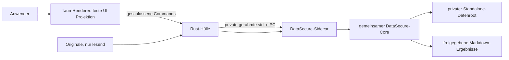

# DataSecure Standalone – Sicherheitsmodell

Stand: 04.09.2026 · Entscheidungen DS-075 bis DS-077

## Geltungsbereich

Dieses Dokument beschreibt ausschließlich das zweite Produkt **DataSecure
Standalone**. Es ist kein Modus des Claude-Plugins. Standalone benötigt weder
Claude, Cowork, MCP, Skills, Agenten noch Internet und verwendet den getrennten
Datenroot `SecureDataMsg-Standalone`.

## Vertrauensgrenzen

- Der Renderer erhält keine Quellpfade, Rohbytes, Dokumenttexte, Mappingdaten,
  Tokens, Kommandozeilen oder freien Exceptions. Er hat keinen direkten Datei-,
  Shell-, Dialog- oder Netzwerkzugriff.
- Nur die Rust-Hülle öffnet native Datei-/Ordnerdialoge. Sie übergibt absolute
  Quellen über den privaten Prozesskanal an den Sidecar.
- Der Sidecar wird bei Bedarf gestartet. Sein Environment wird geleert und auf
  eine feste OS-/Locale-/DataSecure-Allowlist reduziert. Proxy-, Cloud-, API-
  und Agentenwerte werden nicht weitergegeben.
- Jede IPC-Nachricht ist längengerahmt und auf 1 MiB begrenzt. Timeout,
  Protokollfehler oder unerwartetes Prozessende verwerfen den Kanal und beenden
  den Sidecar; der nächste Aufruf startet eine neue Instanz.
- Es gibt keinen localhost-HTTP-/WebSocket-Listener und keinen Auto-Updater.

## Datenlebenszyklus

Originale werden nur lesend aufgenommen und niemals verändert, verschoben oder
automatisch gelöscht. Private Snapshots, Journale, Review- und Recoverydaten
liegen ausschließlich im Standalone-Datenroot. Freigegeben wird nur das nach
Parser-, PII- und Residual-Gates verifizierte Markdown. Mapping bleibt lokal und
ist kein Diagnose-Log.

Ein Fehler stoppt fail-closed. Fortsetzbare Stapel erscheinen als `stopped` und
`resumable`; die Oberfläche darf weder Erfolg noch einen neuen Stapel vortäuschen.
Passwortgeschützte und nicht freigegebene Formate bleiben unverändert und
erzeugen kein Teilresultat dieser Datei.

## Paket- und Supply-Chain-Grenze

Das Windows-x64-Engineering-Paket enthält Tauri-Hülle, gepinnte offizielle
Node-Runtime, eine beim Paketbau frisch erzeugte geschlossene Coreprojektion,
Manifest, Runtime-Evidence, SBOM, Lizenzhinweise und SHA-256. Anwender
installieren keine Rust-, Node- oder Python-Toolchain. Microsoft Edge WebView2
ist eine dokumentierte Systemvoraussetzung und wird nicht nachgeladen.

Das Engineering-SBOM inventarisiert Rust-Crates, setzt deren Lizenzfelder aber
noch auf `NOASSERTION`. Vor einem Endnutzerrelease ist eine komponentenweise
Lizenzprüfung Pflicht. Windows-UAT und native macOS-Intel-/ARM-Pakete samt UAT
sind ebenfalls noch offen. Bis dahin ist das Paket ein Engineering-Pilot.

## Nichtziele

- keine rechtssichere Anonymitäts- oder Zertifizierungszusage;
- keine Entschlüsselung passwortgeschützter Quellen;
- keine Cloud-, Remote- oder Browser-only-Verarbeitung;
- kein Drag-and-drop oder Pausieren als Istfunktion, bevor Implementierung und
  Recovery-/UI-Tests vorliegen;
- keine Freigabe von XLSX, PPTX, PDF, Scan-PDF oder Bildern ohne eigene Coverage.
