# UML-Sicht auf die aktuelle DataSecure-Architektur

Stand: 04.09.2026 · Produktstand 3.2.0-rc98

Die Abschnitte 1 bis 10 bilden den tatsächlich implementierten Pluginpfad ab.
Abschnitt 11 kennzeichnet das UX-Zielbild und die Standalone-Sequenz ausdrücklich
als Zielarchitektur; eine dargestellte Kante ist dort kein Implementierungsbeleg.
Dieses Dokument ist
eine Navigations- und Prüfsicht auf `mcp-server.js`, die getrennten Worker, die
Batch-Module, den lokalen Review, die Ergebnisprojektion und die Diagnose. Der
normative Produktvertrag bleibt in `PRODUCT.md`, `DECISIONS.md` und den
Einzelverträgen unter `contracts/`.

## 1. Systemkontext

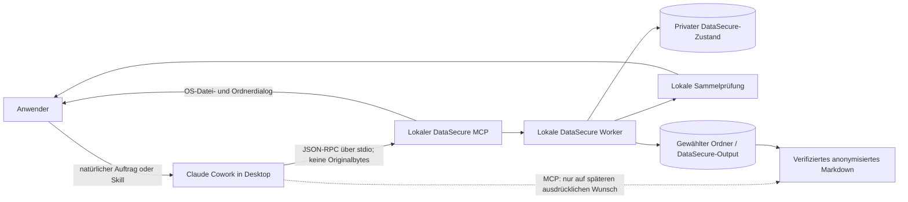

Originale, private Snapshots, Reviewtext, Mappings, Pfade und Dateinamen bleiben
außerhalb der Modellgrenze. Die normale Übergabe an Cowork bestätigt nur den
lokalen Worker-Hand-off; sie ist kein Abschlussnachweis.
Liegt `DataSecure-Output` in einem mit Cowork verbundenen Arbeitsordner, kann
der Host die dort sichtbaren Dateien entsprechend seiner Ordnerberechtigung
lesen. DataSecure steuert nur seine MCP-Rückgaben, nicht den danach möglichen
Dateizugriff des Hosts.

## 2. Komponenten und Verantwortungen

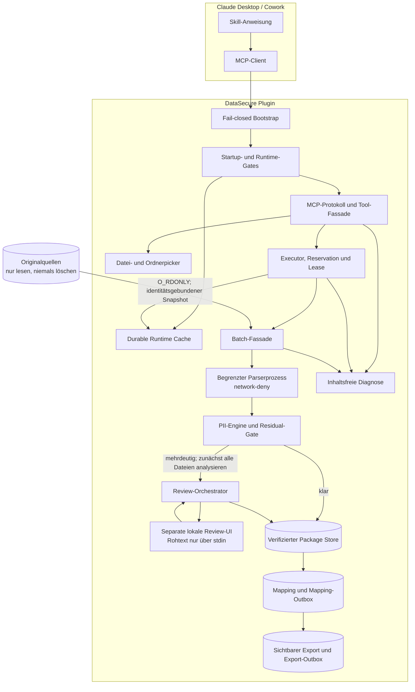

`batch.js` ist eine Kompositionsfassade. Journal, Recovery, Review, Mapping,
Delivery, Locks und Ergebniszugriff sind in eigenständige Gateway-Module
zerlegt. Eine Debug-Variante darf diese Verarbeitung nicht duplizieren.
Ein freigegebenes internes Paket, ein abgeschlossenes Mapping und eine sichtbare
Exportkopie sind drei verschiedene Zustände.

## 3. Deployment und Dateisystem

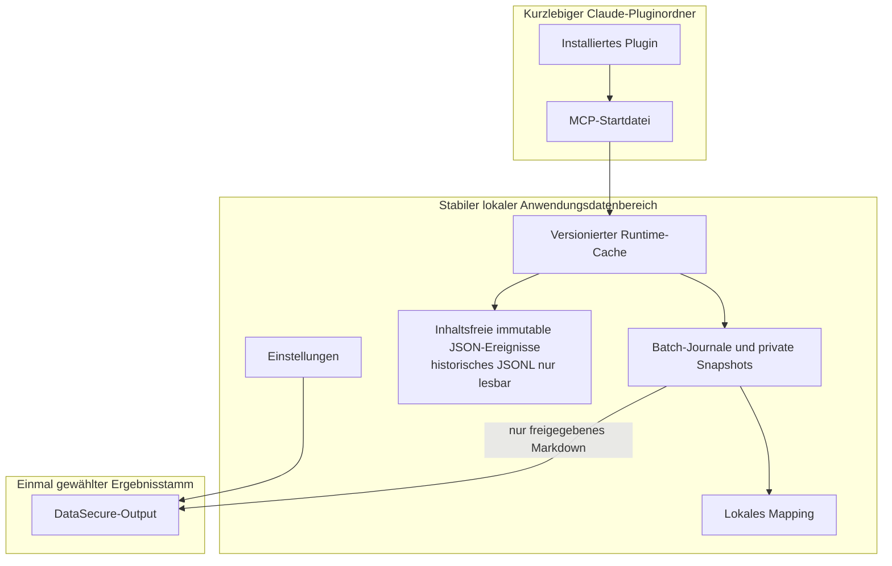

| Plattform | Produktdatenstamm | Nicht als Windows-Produktpfad verwenden |
|---|---|---|
| Windows | `%LOCALAPPDATA%\SecureDataMsg`; bei eindeutigem Claude-Temporärwert das vorhandene reguläre `%USERPROFILE%\AppData\Local\SecureDataMsg` | `%APPDATA%\SecureDataMsg`, `%USERPROFILE%\.local\share\SecureDataMsg` |
| macOS | `~/Library/Application Support/SecureDataMsg` | Windows- und XDG-Pfade |
| Linux/POSIX | `${XDG_DATA_HOME:-~/.local/share}/SecureDataMsg` | Windows-Pfade |

Die beiden vom UAT genannten, nicht existierenden Windows-Kandidaten
`%USERPROFILE%\.local\share\SecureDataMsg` und `%APPDATA%\SecureDataMsg` sind
weder erforderlich noch Schreibziel des Windows-Produktpfads. `.local/share`
ist ausschließlich der POSIX-Fallback; `APPDATA` wird nur an Kindprozesse
weitergereicht, weil der Host ihn bereitstellen kann.

## 4. Sequenz: normaler Cowork-Start

```mermaid
sequenceDiagram
  actor U as Anwender
  participant C as Cowork
  participant M as lokaler MCP
  participant F as OS-Picker
  participant W as Intake-Worker
  participant J as Batch-Journal
  participant P as Package/Mapping
  participant O as DataSecure-Output

  U->>C: Dateien anonymisieren
  C->>M: start_document_batch_from_picker
  alt noch kein Ergebnisstamm konfiguriert
    M->>F: Ergebnisordner einmalig wählen
    U->>F: Ordner bestätigen
    F-->>M: lokale Pfadwahl
  end
  M->>F: Quellen wählen
  U->>F: Dateien oder Ordner bestätigen
  F-->>M: lokale Quellen
  M->>W: private IPC-Übergabe
  W-->>M: Empfangs-ACK local-intake-accepted
  M-->>C: Hand-off bestätigt; noch kein Checkpoint/Abschluss
  W->>J: Snapshot und Checkpoint
  W->>W: lokal analysieren und prüfen
  opt Mehrdeutigkeiten nach Analyse des gesamten Stapels
    W-->>U: eine lokale Sammelprüfung
  end
  W->>P: interne Pakete, Mapping und terminale Evidenz
  alt Stapel terminal vollständig
    P->>O: freigegebenes Markdown exklusiv und atomar projizieren
  else Export vorübergehend nicht möglich
    P->>P: Export-Outbox bleibt fortsetzbar
  end
  W-->>U: lokaler Abschluss- oder Fortsetzungshinweis
```

Zwei Dialoge sind nur beim ersten erfolgreichen Einrichten erwartbar: zuerst
der dauerhafte Ergebnisstamm, danach die Quelle. Jeder spätere normale Lauf
öffnet nur die Quellauswahl. Ein dritter Dialog oder das erneute Öffnen der
Quelle ohne neuen Nutzerauftrag ist ein Fehler.
Vor jeder erstmaligen Ergebnisordnerwahl prüft der MCP Betriebsbereitschaft und
aktive Verarbeitung; ein Lauf, der nicht starten kann, darf keinen Setupdialog
öffnen.

## 5. Aktivitätsdiagramm der Verarbeitung

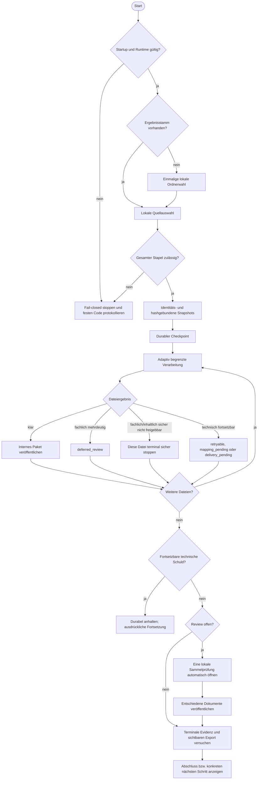

## 6. Getrennte Zustandsmodelle

### 6.1 Persistierter Zustand einer Dokumentposition

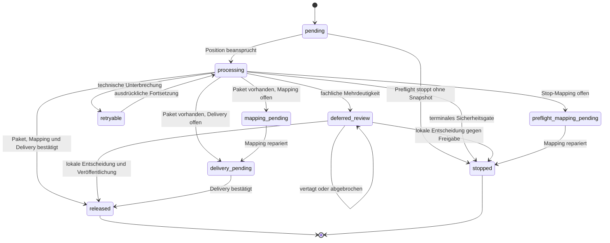

### 6.2 Abgeleitete öffentliche Stapelphase

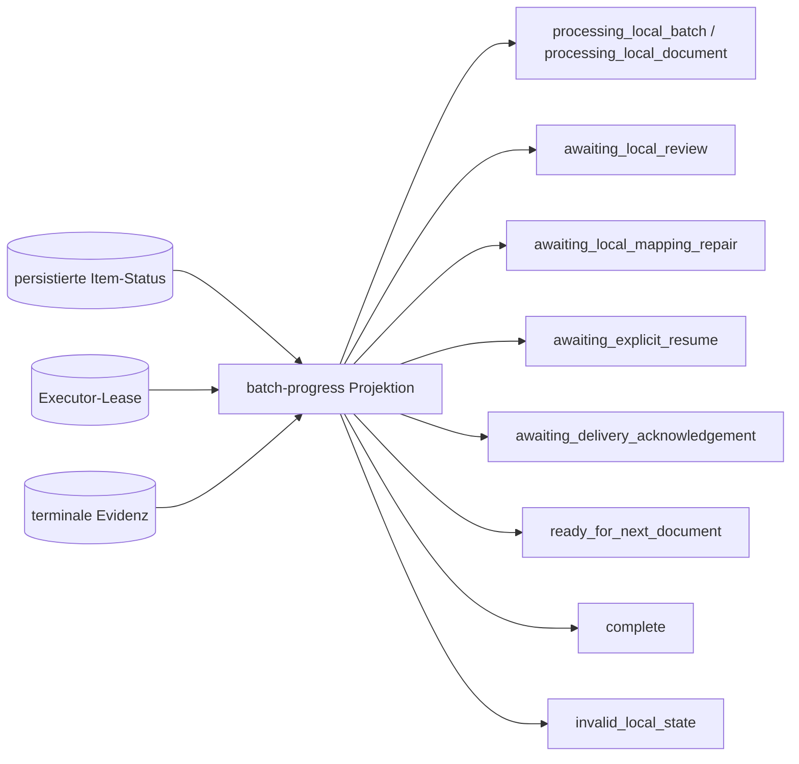

`batch_phase` wird nicht als unabhängiger Zustand gespeichert. Sie wird bei
jeder Abfrage aus Item-Status, Executor-Lebendigkeit und terminaler Evidenz
berechnet. `reserved` ist wiederum eine kurzlebige Intake-/UI-Reservation und
gehört in kein persistiertes Item-Zustandsdiagramm. Ein Stapel ist nicht deshalb
vollständig, weil der MCP-Aufruf geantwortet hat.

### 6.3 Globale Ownership-Invariante

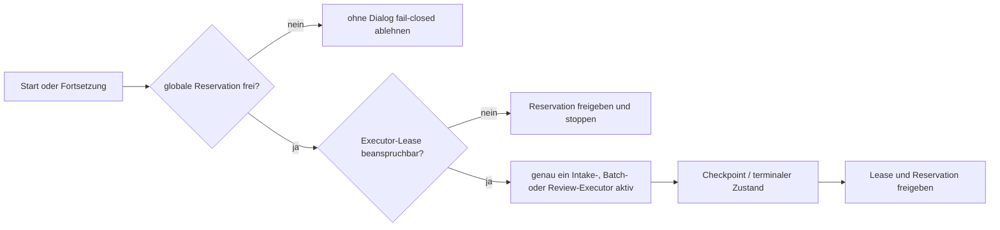

Mehrere pausierte Stapel dürfen existieren; gleichzeitig aktiv sein darf nur
eine lokale Aufnahme, Stapelverarbeitung oder Prüfung. Prozessabsturz und
PID-Wiederverwendung bleiben deshalb besonders prüfpflichtige Lease-Grenzen.

## 7. Review- und Fortsetzungssequenz

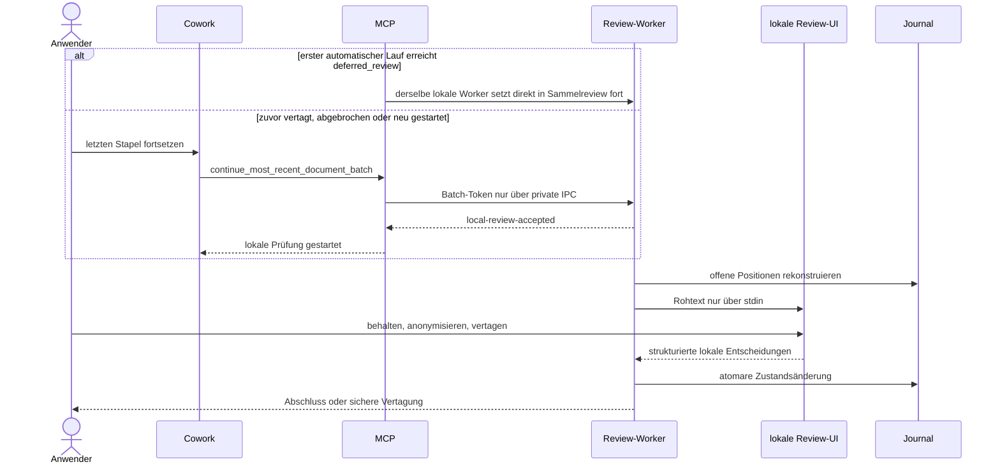

## 8. Datenmodell der wesentlichen Artefakte

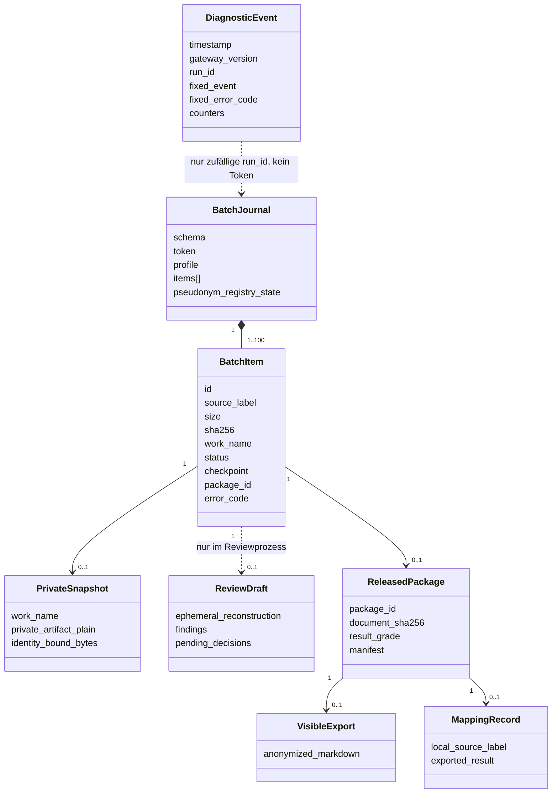

Diagnoseereignisse dürfen keine Quelllabels, Namen, Pfade, Tokens, Hashes,
Dokumenttexte oder Reviewentscheidungen enthalten. Ein zufälliges `run_id`
korreliert ausschließlich technische Phasen und ist keine Journalbeziehung.
`ReviewDraft` wird nicht persistiert, sondern bei Bedarf aus der privaten
Arbeitskopie rekonstruiert. Preflight-Stopps besitzen keine Arbeitskopie;
bereinigte terminale Positionen können sie bereits wieder entfernt haben.

## 9. Diagnose- und Debugsicht

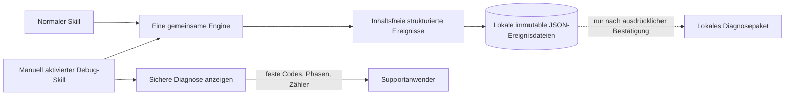

Der Debug-Skill ist keine zweite Anonymisierung. Er wird nicht automatisch vom
Modell geladen, aktiviert den bereits vorhandenen lokalen Supportmodus und nutzt
dieselben Tools, Gates, Worker und Zustände. Das MCP-Protokoll ist JSON-RPC über
`stdio`, nicht REST. Rohes JSON-RPC darf wegen Tokens, Pfaden und Argumenten
nicht protokolliert werden; gespeichert wird nur eine geschlossene Projektion.

## 10. Aus der UML-Prüfung abgeleitete Befunde

1. **Pfadwahrheit:** Windows besitzt genau einen Produktdatenstamm unter
   `LOCALAPPDATA` beziehungsweise den DS-073-Fallback. Die POSIX- und
   `APPDATA`-Kandidaten dürfen in Windows-Diagnosen nicht als benötigte Ordner
   erscheinen.
2. **Erster Lauf:** Die Ergebnisordnerwahl vor der Quellauswahl ist technisch
   korrekt, aber ohne eindeutigen Dialogtitel leicht mit dem Eingabeordner zu
   verwechseln. Die lokale UI muss beide Zwecke unmissverständlich benennen.
3. **Übergabe ist nicht Abschluss:** IPC-Acceptance, Checkpoint,
   Verarbeitungsstart, Review und sichtbarer Export sind getrennte Ereignisse.
   Eine frühe Cowork-Antwort darf keinen fertigen Output behaupten.
4. **Supportaktivierung:** Der Server besitzt einen geschützten
   `EU_PRIVACY_SUPPORT_MODE`; die bewusst manuell aufrufbare Debug-Skill-
   Oberfläche und das eindeutig gekennzeichnete Supportpaket sind umgesetzt.
5. **Diagnosevollständigkeit:** Fach-, Workflow- und Supportdiagnose schreiben
   unveränderliche Einzelereignisse. Historische JSONL-Dateien werden nur noch
   als Upgradequelle gelesen. MCP-Toolgrenze, Ergebnisordnerwahl und
   Runtime-Projektion sind als zusammenhängende, inhaltsfreie Spur sichtbar.
6. **Mehrprozessschreiben:** Eltern-, Intake- und Review-Prozess können gleichzeitig
   Diagnoseereignisse erzeugen. Das frühere Lesen-und-Ersetzen einer einzelnen
   JSONL-Datei besaß ein Lost-Update-Risiko; alle drei Diagnosespuren verwenden
   deshalb jetzt dieselbe unveränderliche, mehrprozesssichere Ereignisspool-
   Komponente. Alters- und Mengengrenzen löschen die Einzeldateien physisch.
7. **Keine Diagnosewirkung:** Ein Fehler beim Protokollieren darf niemals eine
   Datenschutzentscheidung, Veröffentlichung oder Fortsetzung verändern.

8. **Exklusive Ergebnisprojektion:** Sichtbare Ergebnisse werden atomar ohne
   Überschreiben publiziert. Eine zwischen Prüfung und Veröffentlichung
   entstandene Benutzerdatei bleibt unverändert; der Export bleibt fortsetzbar.
9. **Begrenzte Protokollaufnahme:** Ein JSON-RPC-Frame ist vor dem Parsen auf
   1 MiB begrenzt. Ein übergroßer Frame wird vollständig bis zum nächsten
   Zeilenende verworfen; nachfolgende gültige Anfragen bleiben verarbeitbar.
10. **Offene Produktverbesserungen:** Stapelgebundener statt nur globaler
   Ergebnisstamm, sichtbare Teilresultate bei vertagtem Review, echte
   plattformübergreifende Sammelprüfung, bestätigte Sichtbarkeit der
   Abschlussoberfläche und passive Fortschrittsanzeige benötigen jeweils eine
   eigene Architektur- und UAT-Lieferung.

Die Punkte 4 bis 6, 8 und 9 sind als E0-Arbeitspakete umgesetzt. Punkt 2 bleibt als
beobachtbare UX-Abnahme zusätzlich offen; die technische Pfadtrennung selbst ist
bereits implementiert. Die unter Punkt 10 genannten Änderungen sind bewusst
nicht durch UML-Dokumentation vorgetäuscht, sondern im Backlog getrennt offen.

## 11. Zielarchitektur: UX und Standalone

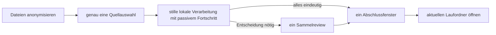

- **Keine automatische Workspace-Vermutung:** Die MCP-Schnittstelle liefert
  keinen belastbaren Cowork-Arbeitsordner. DataSecure behält daher einen explizit
  vom Anwender gewählten Standard, bindet dessen Identität beim Start an den
  Stapel und ändert ihn nur über die bewusste Einstellung „Ergebnisordner
  ändern“. Es entsteht keine Rückfrage pro Datei oder Lauf.
- **Ein eindeutiger Abschluss:** Erst eine lokal belegte sichtbare Oberfläche
  schließt die Präsentationsreservation. Das Fenster öffnet den konkreten
  `Lauf-*`-Ordner und bietet bei ausstehendem Export genau eine Reparaturaktion.
- **Ein Review:** Das gemeinsame Reviewmodell bleibt plattformneutral; jeder
  freigegebene Zielhost benötigt nur einen lokalen Adapter, der alle offenen
  Entscheidungen in einer Oberfläche und mit einer Schlussfreigabe darstellt.
  Einzelne Dialoge je Treffer sind lediglich ein Engineering-Fallback und kein
  freigegebener Sollweg.
- **Sichtbarer Fortschritt ohne Interaktion:** Lange Stapel zeigen nur lokale,
  inhaltsfreie Zähler. Bereits eindeutige Ergebnisse dürfen nach eigenständigem
  Architekturentscheid in denselben Laufordner projiziert werden; der Ordner
  kennzeichnet den Stapel bis zum letzten Review weiterhin als unvollständig.

Dieses Zielbild beschreibt zwei Endnutzerprodukte mit genau einem gemeinsamen
DataSecure-Core. Das Plugin übersetzt MCP-/Cowork-Aufrufe, Standalone übersetzt
lokale UI-Aktionen. Produktdaten und Handoffzustände bleiben strikt getrennt.

### Standalone- und Konvertersequenz nach DS-075

Diese Sequenz ist als Windows-Engineering-Vertikalschnitt ausführbar.
Implementiert sind Tauri-Hülle, nativer Datei-/Ordnerpicker, Node-Application-
Service, strenge UI-Projektion, privater längengerahmter Dispatcher,
Sidecar-Lebensdauer und Zielkatalog. Der Windows-Prozessstart wurde geprüft.
Offen sind das selbsttragende Endnutzerpaket und die nativen macOS-/Linux-
Nachweise.

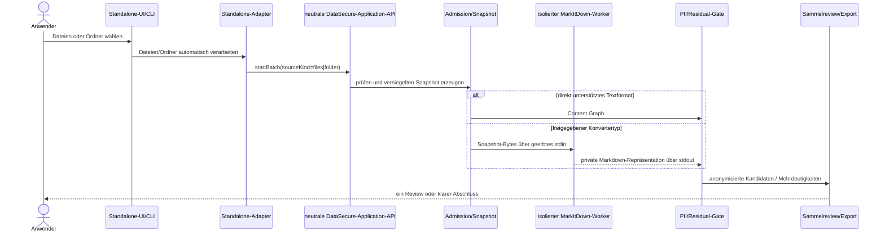

MarkItDown darf die Engine weder umgehen noch selbst ein Format freigeben. Ein
noch personenbezogenes Konvertat ist kein Ergebnisartefakt und wird nicht im
sichtbaren Dateisystem abgelegt.
