# UML-Sicht auf die aktuelle DataSecure-Architektur

Stand: 10.09.2026 · 3.2.0-rc132

Die Abschnitte 1 bis 10 bilden den tatsächlich implementierten Pluginpfad ab.
Abschnitt 11 trennt den implementierten Standalone-Vertikalschnitt von weiterhin
offener Implementierung und Zielhostevidenz; eine als offen bezeichnete Kante ist kein Implementierungsbeleg.
Die aktuelle Produkt-/Zweckmatrix steht in
[`TARGET_ARCHITECTURE.md`](TARGET_ARCHITECTURE.md#aktuelle-fähigkeiten-nach-produkt-und-zweck).
Dieses Dokument ist
eine Navigations- und Prüfsicht auf `mcp-server.js`, die getrennten Worker, die
Batch-Module, den lokalen Review, die Ergebnisprojektion und die Diagnose. Der
normative Produktvertrag bleibt in `PRODUCT.md`, `DECISIONS.md` und den
Einzelverträgen unter `contracts/`.

RC109: Die produktunabhängigen Verträge für nächste Stapelaktion,
Konverterkommunikation und Ergebnisgrad liegen in `server/core/`.
MCP- und Standaloneadapter konsumieren dieselbe Implementierung; frühere
Importpfade sind nur Reexports. Die nachstehenden Batch-/Worker-Kanten sind
dadurch noch keine vollständig entkoppelte Application API: Verifikation mit
Dateizugriff und öffentliche Antwortprojektion bleiben teilweise komponiert.

## 1. Systemkontext

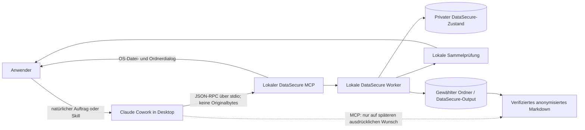

Originale, private Snapshots, Reviewtext, Mappings, Pfade und Dateinamen bleiben
außerhalb der Modellgrenze. Der Originalweg setzt den nach DS-078 zugelassenen
lokalen Claude-Host mit verbundenem Plugin-MCP voraus; eine vom Hersteller
angebotene Desktop-Brücke erweitert diese Produktfreigabe nicht automatisch.
Die normale Übergabe an Cowork bestätigt nur den
lokalen Worker-Hand-off; sie ist kein Abschlussnachweis.
Die eingezeichnete Sammelprüfung besitzt einen Windows-Sammeladapter und einen
einzelnen scrollbaren AppKit-Mac-Sammeldialog. Der macOS-Abschlussadapter meldet
erst nach einem sichtbaren Fenster `SHOWN`. Native Intel-/ARM-Ausführung,
Fokus, Accessibility und Bedienverständlichkeit sind noch Zielhostnachweise
(BL-012.9/10, BL-012.2/041.10), keine weitere Dialogarchitektur. Reine
Standalone-Markdown-Konvertierung nutzt keine PII-Prüfung.
Liegt `DataSecure-Output` in einem mit Cowork verbundenen Arbeitsordner, kann
der Host die dort sichtbaren Dateien entsprechend seiner Ordnerberechtigung
lesen. DataSecure steuert nur seine MCP-Rückgaben, nicht den danach möglichen
Dateizugriff des Hosts.

## 2. Komponenten und Verantwortungen

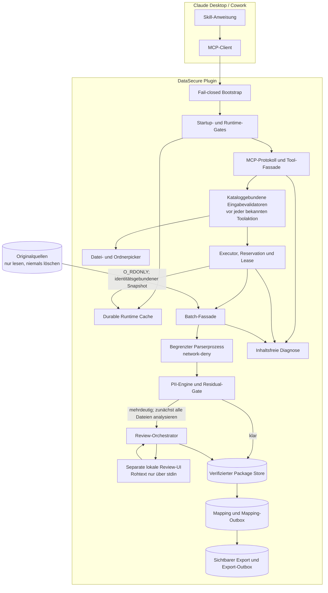

`batch.js` ist eine Kompositionsfassade. Journal, Recovery, Review, Mapping,
Delivery, Locks und Ergebniszugriff sind in eigenständige Gateway-Module
zerlegt. Eine Debug-Variante darf diese Verarbeitung nicht duplizieren.
Ein freigegebenes internes Paket, ein abgeschlossenes Mapping und eine sichtbare
Exportkopie sind drei verschiedene Zustände.

## 3. Deployment und Dateisystem

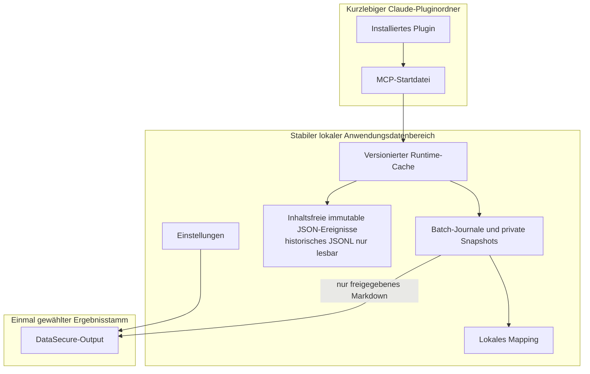

| Plattform | Produktdatenstamm | Nicht als Windows-Produktpfad verwenden |
|---|---|---|
| Windows | `%LOCALAPPDATA%\SecureDataMsg`; bei eindeutigem Claude-Temporärwert das vorhandene reguläre `%USERPROFILE%\AppData\Local\SecureDataMsg` | `%APPDATA%\SecureDataMsg`, `%USERPROFILE%\.local\share\SecureDataMsg` |
| macOS | `~/Library/Application Support/SecureDataMsg` | Windows- und XDG-Pfade |
| Linux/POSIX | `${XDG_DATA_HOME:-~/.local/share}/SecureDataMsg` | Windows-Pfade |

Die beiden vom UAT genannten, nicht existierenden Windows-Kandidaten
`%USERPROFILE%\.local\share\SecureDataMsg` und `%APPDATA%\SecureDataMsg` sind
weder erforderlich noch Schreibziel des Windows-Produktpfads. `.local/share`
ist ausschließlich der POSIX-Fallback; `APPDATA` wird nur an Kindprozesse
weitergereicht, weil der Host ihn bereitstellen kann.

## 4. Sequenz: normaler Cowork-Start

```mermaid
sequenceDiagram
  actor U as Anwender
  participant C as Cowork
  participant M as lokaler MCP
  participant F as OS-Picker
  participant W as Intake-Worker
  participant J as Batch-Journal
  participant P as Package/Mapping
  participant O as DataSecure-Output

  U->>C: Dateien anonymisieren
  C->>M: start_document_batch_from_picker
  alt noch kein Ergebnisstamm konfiguriert
    M->>F: Ergebnisordner einmalig wählen
    U->>F: Ordner bestätigen
    F-->>M: lokale Pfadwahl
  end
  M->>F: Quellen wählen
  U->>F: Dateien oder Ordner bestätigen
  F-->>M: lokale Quellen
  M->>W: private IPC-Übergabe
  W-->>M: Empfangs-ACK local-intake-accepted
  M-->>C: Hand-off bestätigt; noch kein Checkpoint/Abschluss
  W->>J: Snapshot und Checkpoint
  W->>W: lokal analysieren und prüfen
  opt Mehrdeutigkeiten nach Analyse des gesamten Stapels
    W-->>U: eine lokale Sammelprüfung
  end
  W->>P: interne Pakete, Mapping und terminale Evidenz
  alt Stapel terminal vollständig
    P->>O: freigegebenes Markdown exklusiv und atomar projizieren
  else Export vorübergehend nicht möglich
    P->>P: Export-Outbox bleibt fortsetzbar
  end
  W-->>U: lokaler Abschluss- oder Fortsetzungshinweis
```

Zwei Dialoge sind nur beim ersten erfolgreichen Einrichten erwartbar: zuerst
der dauerhafte Ergebnisstamm, danach die Quelle. Jeder spätere normale Lauf
öffnet nur die Quellauswahl. Ein dritter Dialog oder das erneute Öffnen der
Quelle ohne neuen Nutzerauftrag ist ein Fehler.
Vor jeder erstmaligen Ergebnisordnerwahl prüft der MCP Betriebsbereitschaft und
aktive Verarbeitung; ein Lauf, der nicht starten kann, darf keinen Setupdialog
öffnen.

## 5. Aktivitätsdiagramm der Verarbeitung

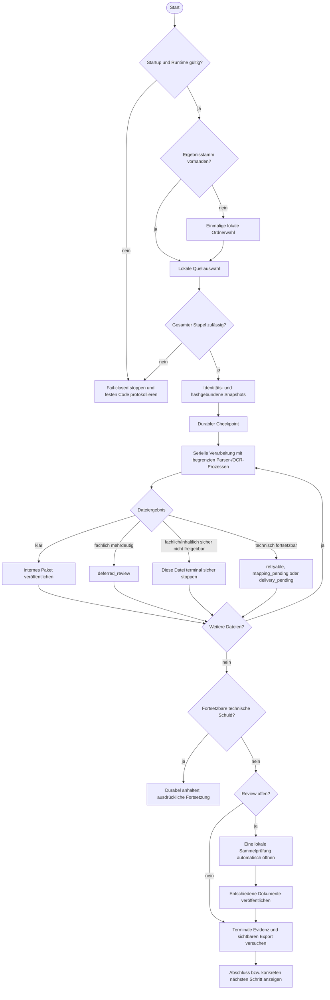

## 6. Getrennte Zustandsmodelle

### 6.1 Persistierter Zustand einer Dokumentposition

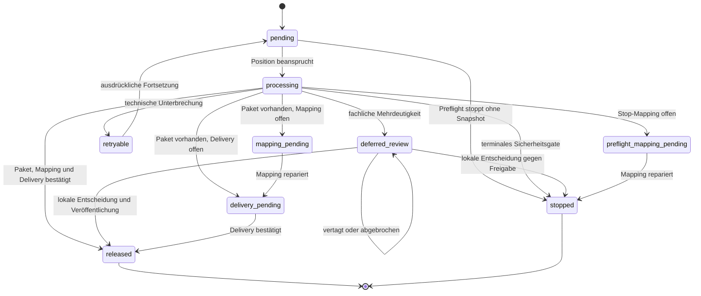

`stopped` ist erst mit dauerhaft vorhandenem erforderlichem Mapping terminal.
Ein noch gesetztes `local_mapping_exported: false` zählt zur Mappingreparatur
und nicht zu abgeschlossenen Positionen.

### 6.2 Abgeleitete öffentliche Stapelphase

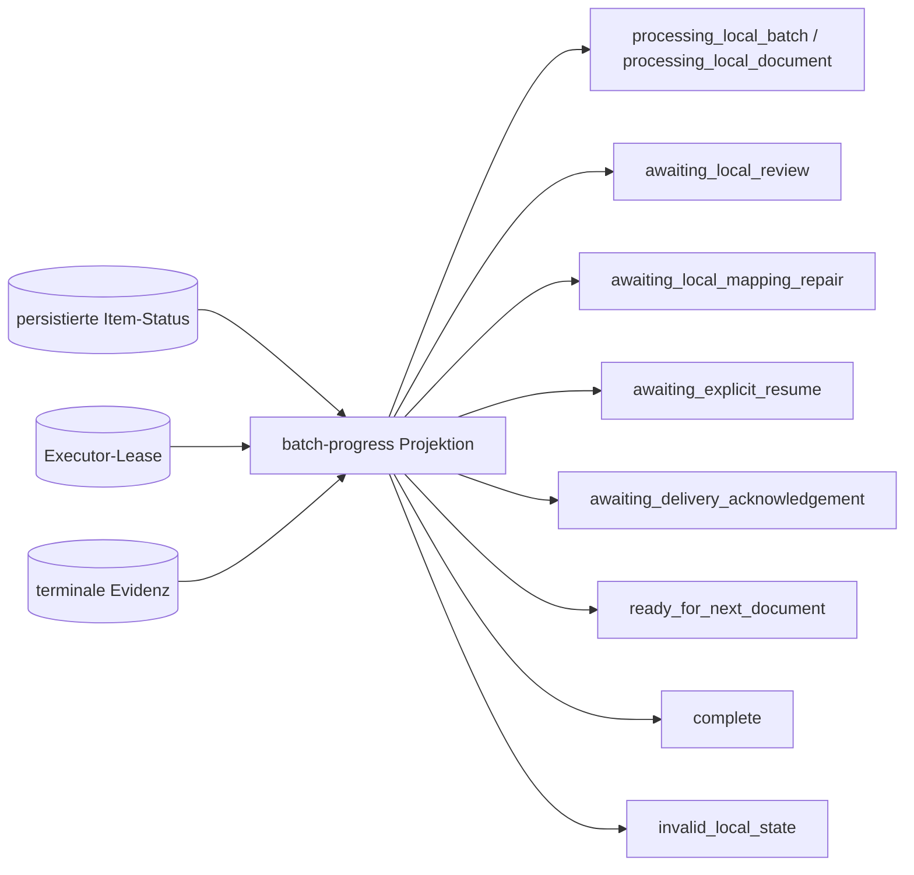

`batch_phase` wird nicht als unabhängiger Zustand gespeichert. Sie wird bei
jeder Abfrage aus Item-Status, Executor-Lebendigkeit und terminaler Evidenz
berechnet. `reserved` ist wiederum eine kurzlebige Intake-/UI-Reservation und
gehört in kein persistiertes Item-Zustandsdiagramm. Ein Stapel ist nicht deshalb
vollständig, weil der MCP-Aufruf geantwortet hat.
`completed` zählt `released + stopped` für terminale Positionen; Ergebnis- und
Fehlerzahlen bleiben separat. `awaiting_local_review` setzt offene Reviewpositionen
und zugleich null verbleibende, verarbeitende, wiederholbare, Delivery- und
Mappingpositionen voraus. `batch-next-action.js` teilt diesen Vertrag mit beiden
Produktadaptern, Reviewplanung und automatischem Reviewübergang. Fehlende Zähler
belegen keine Bereitschaft. Außerdem müssen terminale plus Reviewpositionen
den gesamten Stapel abdecken. Unbekannte Itemzustände sind
`invalid_local_state`, niemals ein ausgelassener Rest mit Reviewfreigabe.

### 6.3 Globale Ownership-Invariante

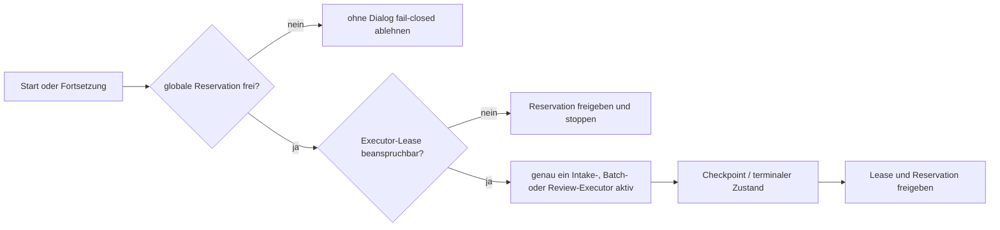

Mehrere pausierte Stapel dürfen existieren; gleichzeitig aktiv sein darf nur
eine lokale Aufnahme, Stapelverarbeitung oder Prüfung. Executor-Leases binden
deshalb PID und gehashte Betriebssystem-Startidentität: eine nachweislich
wiederverwendete PID ist kein lebender Eigentümer, eine nicht sicher
beobachtbare Identität blockiert dagegen fail-closed.

## 7. Review- und Fortsetzungssequenz

```mermaid
sequenceDiagram
  actor U as Anwender
  participant C as Cowork
  participant M as MCP
  participant W as lokaler Batch-/Review-Worker
  participant UI as lokale Review-UI
  participant J as Journal

  alt automatischer Lauf hat alle technische Arbeit abgeschlossen und Review ist bereit
    W->>W: gemeinsamer Readinessvertrag erlaubt Sammelreview
  else zuvor vertagt, abgebrochen oder neu gestartet
    U->>C: letzten Stapel fortsetzen
    C->>M: continue_most_recent_document_batch
    M->>J: Zustand erneut prüfen, unterbrochene Positionen fortsetzbar machen
    M->>M: batchNextAction aus vollständigem Fortschritt
    alt automatische Arbeit einschließlich Delivery oder Mapping offen
      M->>W: Batch-Worker starten; Token nur über private IPC
      W-->>M: lokales Empfangs-ACK
      M-->>C: Fortsetzung angenommen, noch kein Abschluss
      W->>J: offene automatische Arbeit abschließen
      W->>W: nur bei gemeinsamer Reviewbereitschaft automatisch weiter
    else nur Reviewentscheidungen offen
      M->>W: Review-Worker starten; Token nur über private IPC
      W-->>M: local-review-accepted
      M-->>C: lokale Übernahme bestätigt; noch kein UI-/Abschlussnachweis
    end
  end
  opt Review bereit
    W->>J: ausschließlich offene Reviewpositionen rekonstruieren
    W->>UI: Rohtext nur über stdin
    U->>UI: behalten, anonymisieren, vertagen
    UI-->>W: strukturierte lokale Entscheidungen
    W->>J: atomare Zustandsänderung
  end
  W-->>U: Abschluss oder sichere Vertagung
```

Der ausdrücklich aktivierte Supportweg `review_deferred_document_batch` nutzt
ebenfalls diesen festen, netzwerkgesperrten Worker. Die MCP-Seite liest nur den
Metadatenstatus des angegebenen Stapels; sie rekonstruiert keinen Rohtext.
`batchReviewCanPrepare` lässt zusätzlich vollständig gezählte Reparaturpositionen
zu (Veröffentlichung, Zuordnung oder unterbrochene Verarbeitung), wenn keine
Pending-/Retryposition und kein aktiver Worker vorliegt. Das ist **keine**
Reviewbereitschaft: Der Worker repariert unter seinem exklusiven Lock und prüft
danach `batchReviewReady` erneut. Ein unvollständig rekonstruierbarer Zustand
bleibt gesperrt. Er springt niemals zum jüngsten anderen Stapel.
Die Supportantwort endet nach `local-review-accepted`; ein Timeout/Hostabbruch
belegt nur fehlende Bestätigung und darf keinen automatischen zweiten Start
auslösen. Die feste Werkzeugargumentstruktur bleibt unverändert.

## 8. Datenmodell der wesentlichen Artefakte

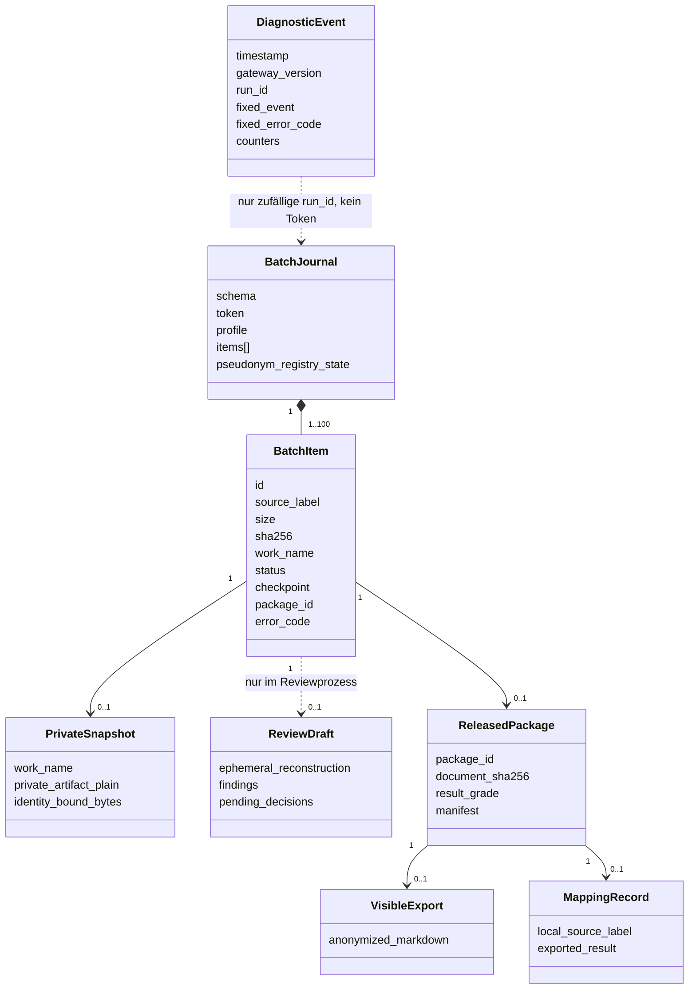

Diagnoseereignisse dürfen keine Quelllabels, Namen, Pfade, Tokens, Hashes,
Dokumenttexte oder Reviewentscheidungen enthalten. Ein zufälliges `run_id`
korreliert ausschließlich technische Phasen und ist keine Journalbeziehung.
`ReviewDraft` wird nicht persistiert, sondern bei Bedarf aus der privaten
Arbeitskopie rekonstruiert. Preflight-Stopps besitzen keine Arbeitskopie;
bereinigte terminale Positionen können sie bereits wieder entfernt haben.

## 9. Diagnose- und Debugsicht

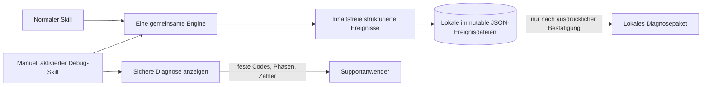

Der Debug-Skill ist keine zweite Anonymisierung. Er wird nicht automatisch vom
Modell geladen, aktiviert den bereits vorhandenen lokalen Supportmodus und nutzt
dieselben Tools, Gates, Worker und Zustände. Das MCP-Protokoll ist JSON-RPC über
`stdio`, nicht REST. Rohes JSON-RPC darf wegen Tokens, Pfaden und Argumenten
nicht protokolliert werden; gespeichert wird nur eine geschlossene Projektion.

## 10. Aus der UML-Prüfung abgeleitete Befunde

1. **Pfadwahrheit:** Windows besitzt genau einen Produktdatenstamm unter
   `LOCALAPPDATA` beziehungsweise den DS-073-Fallback. Die POSIX- und
   `APPDATA`-Kandidaten dürfen in Windows-Diagnosen nicht als benötigte Ordner
   erscheinen.
2. **Erster Lauf:** Die Ergebnisordnerwahl vor der Quellauswahl ist technisch
   korrekt, aber ohne eindeutigen Dialogtitel leicht mit dem Eingabeordner zu
   verwechseln. Die lokale UI muss beide Zwecke unmissverständlich benennen.
3. **Übergabe ist nicht Abschluss:** IPC-Acceptance, Checkpoint,
   Verarbeitungsstart, Review und sichtbarer Export sind getrennte Ereignisse.
   Eine frühe Cowork-Antwort darf keinen fertigen Output behaupten.
4. **Supportaktivierung:** Der Server besitzt einen geschützten
   `EU_PRIVACY_SUPPORT_MODE`; die bewusst manuell aufrufbare Debug-Skill-
   Oberfläche und das eindeutig gekennzeichnete Supportpaket sind umgesetzt.
5. **Diagnosevollständigkeit:** Fach-, Workflow- und Supportdiagnose schreiben
   unveränderliche Einzelereignisse. Historische JSONL-Dateien werden nur noch
   als Upgradequelle gelesen. MCP-Toolgrenze, Ergebnisordnerwahl und
   Runtime-Projektion sind als zusammenhängende, inhaltsfreie Spur sichtbar.
6. **Mehrprozessschreiben:** Eltern-, Intake- und Review-Prozess können gleichzeitig
   Diagnoseereignisse erzeugen. Das frühere Lesen-und-Ersetzen einer einzelnen
   JSONL-Datei besaß ein Lost-Update-Risiko; alle drei Diagnosespuren verwenden
   deshalb jetzt dieselbe unveränderliche, mehrprozesssichere Ereignisspool-
   Komponente. Alters- und Mengengrenzen löschen die Einzeldateien physisch.
7. **Keine Diagnosewirkung:** Ein Fehler beim Protokollieren darf niemals eine
   Datenschutzentscheidung, Veröffentlichung oder Fortsetzung verändern.

8. **Exklusive Ergebnisprojektion:** Sichtbare Ergebnisse werden atomar ohne
   Überschreiben publiziert. Eine zwischen Prüfung und Veröffentlichung
   entstandene Benutzerdatei bleibt unverändert; der Export bleibt fortsetzbar.
9. **Begrenzte Protokollaufnahme:** Ein JSON-RPC-Frame ist vor dem Parsen auf
   1 MiB begrenzt. Ein übergroßer Frame wird vollständig bis zum nächsten
   Zeilenende verworfen; nachfolgende gültige Anfragen bleiben verarbeitbar.
10. **Evidencegrenzen:** Ergebnisstamm und sichtbarer Mischstapel sind durch
   DS-079/080 entschieden. Standalone bestätigt Rendering und zeigt passiven
   Fortschritt E0; Windows-Cowork bestätigt das native `Shown`-Ereignis.
   Plattformübergreifender Sammelreview und macOS-Sichtbarkeit stehen E0;
   echte Zielhostbeobachtungen bleiben eigenständige UAT-Lieferungen.

Die Punkte 4 bis 6 sowie 8 bis 10 sind als E0-Arbeitspakete umgesetzt. Punkt 2 bleibt als
beobachtbare UX-Abnahme zusätzlich offen; die technische Pfadtrennung selbst ist
bereits implementiert. Die unter Punkt 10 genannten Zielhostnachweise sind
bewusst nicht durch UML-Dokumentation vorgetäuscht, sondern im Backlog getrennt offen.

## 11. Implementierter UX- und Standalone-Vertikalschnitt

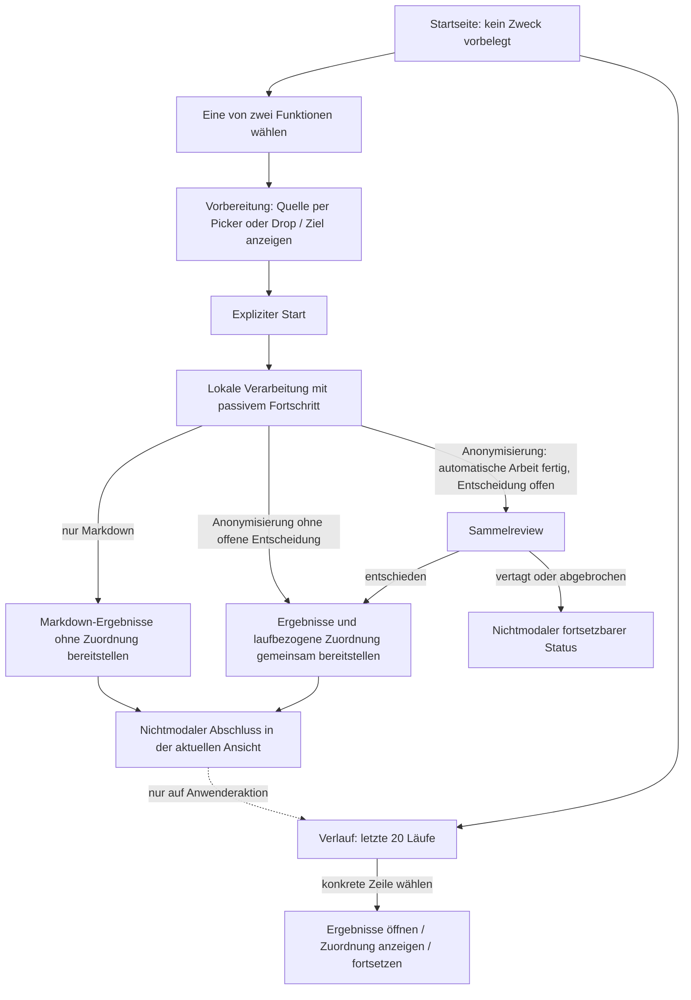

- **Keine automatische Workspace-Vermutung:** Die MCP-Schnittstelle liefert
  keinen belastbaren Cowork-Arbeitsordner. DataSecure behält daher gemäß DS-080
  einen explizit vom Anwender gewählten geräte- und produktlokalen Standard,
  bindet dessen Identität beim Start an den Stapel und ändert ihn nur über die
  bewusste Einstellung „Ergebnisordner ändern“. Der dedizierte Ergebnisordner
  darf optional mit Cowork verbunden werden; DataSecure kann die Liste
  verbundener Cowork-Ordner nicht selbst prüfen. Es entsteht keine Rückfrage pro Datei,
  Lauf oder Projektwechsel.
- **Ein eindeutiger Abschluss:** Das Plugin verwendet seinen lokalen
  Abschlussadapter. Standalone bestätigt die Statusdarstellung im Hauptfenster
  über ein lauf- und generationsgebundenes ACK; es öffnet weder einen separaten
  Abschlussdialog noch automatisch einen `Lauf-*`-Ordner. Ausstehender Export
  bleibt als solcher sichtbar (DS-083/086).
- **Ein Review:** Das gemeinsame Reviewmodell bleibt plattformneutral; jeder
  freigegebene Zielhost benötigt nur einen lokalen Adapter, der alle offenen
  Entscheidungen in einer Oberfläche und mit einer Schlussfreigabe darstellt.
  Einzelne Dialoge je Treffer sind lediglich ein Engineering-Fallback und kein
  freigegebener Sollweg.
- **Sichtbarer Fortschritt ohne Interaktion:** Lange Stapel zeigen nur lokale,
  inhaltsfreie Zähler. Bereits eindeutige Ergebnisse bleiben intern dauerhaft;
  gemäß DS-079 entsteht der sichtbare Laufordner erst nach terminalem
  Gesamtstapel und abgeschlossenem erforderlichem Review.

Diese Sicht beschreibt zwei Endnutzerprodukte mit genau einem gemeinsamen
DataSecure-Core. Das Plugin übersetzt MCP-/Cowork-Aufrufe, Standalone übersetzt
lokale UI-Aktionen. Produktdaten und Handoffzustände bleiben strikt getrennt.

### Zwei gleichwertige Standalone-Modi – Implementierung DS-075/DS-085

Beide Zwecke sind im aktuellen Quellstand ausführbar. Der Startzweck durchläuft
`processingMode` → Rust → `processing_mode` → Service → Intake und Journal;
reine Konvertierung besitzt v5-Journale, eigene Worker-Nachrichten und
`dm_`-Artefakte ohne Privacy-Capabilities. Continue übernimmt ausschließlich
den gespeicherten Zweck. Tauri-Hülle, native Auswahl/Drop, Application-Service,
private gerahmte IPC und laufgebundene Historie sind implementiert. Vorhandene
Windows-Engineering-Pakete und Prozessstarts ersetzen keinen neuen
Releasekandidaten oder menschliche Windows-/macOS-Zielhostabnahme.

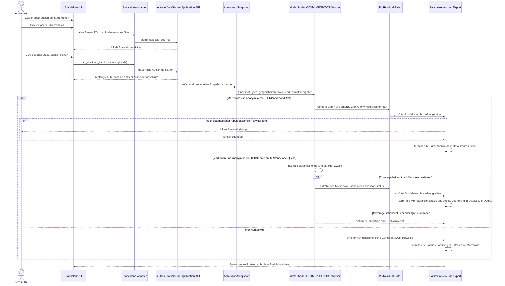

MarkItDown/Python ist nur ein optionales Engineering-Differentialorakel und
gehört nicht zur produktiven Sequenz. Im
Anonymisierungsmodus ist ein noch personenbezogenes Zwischenkonvertat kein
Ergebnisartefakt und wird nicht im sichtbaren Dateisystem abgelegt. Reine
Konvertierung speichert solche Inhalte dagegen ausdrücklich im getrennten,
als nicht anonymisiert gekennzeichneten Ausgabebaum (DS-085). Text-PDF und
Scan-Seiten werden automatisch unterschieden; OCR läuft lokal. Warnungen sind
Teil der Extraktionsidentität und des sichtbaren v4-Exports.

DS-087/090 bindet den DOCX-/breiten Standalone-Zweig an den gemeinsamen
Privacy-Core. DS-093 führt XLSX/PPTX im Cowork-Plugin über dessen bereits
ausgelieferten isolierten Office-Parser in denselben neutralen
Markdown-first-Vertrag; PDF, Scan-PDF und Bilder erreichen diesen Pfad dort
nicht. Die aktuelle reale Wide-Format-Coverage bleibt oft `incomplete`; sie
wird getrennt vom Anonymisierungsstatus geführt. Der
Sequenzzweig schützt den extrahierten Markdown-Inhalt in demselben Stapel und
gibt keine Freigabezusage für ausgelassene Bestandteile der ursprünglichen XLSX-,
DOCX-, PPTX-, PDF-/Scan-PDF- oder Bilddatei.

Recovery setzt den gespeicherten Modus fort; eine UI-Defaultwahl darf ihn nicht
ändern. Inhaltsfreie Diagnose dokumentiert Phase, Modus und Fehler, keine
extrahierten Originalinhalte. Keine rohen Zwischenkonvertate gelangen in den
Plugin-Handoff; ausschließlich erneut geprüftes anonymisiertes Markdown ist
später lesbar.

### Standalone-Abschluss, Export und Neustart

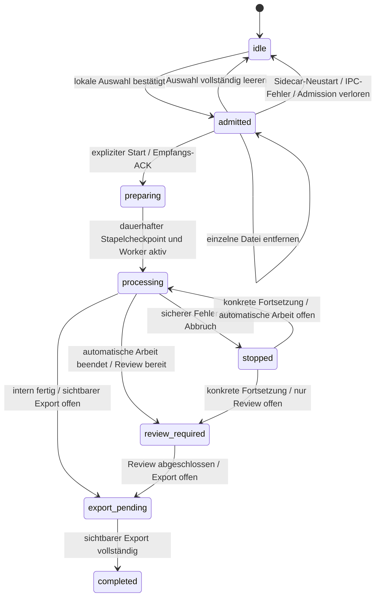

Der Standalone-Status beobachtet den aktiven oder ausdrücklich ausgewählten Lauf
auch nach dessen Abschluss. Nur ohne solche Bindung ist der jüngste Stapel des
eigenen Produktkanals der Standard. Eine historische Fortsetzung darf daher
keinen neueren Lauf, dessen Zweck oder dessen Zähler übernehmen. Ein interner Paketabschluss ist kein sichtbarer
Erfolg. Offene Exporte werden beim Standalone-Start und nach einer bewussten
Ergebnisordnerwahl erneut versucht; der Zielordner ist vor dem ersten Teilexport
identitätsgebunden. Standalone-Worker öffnen keine Cowork-Dialoge. Die Tauri-UI
verwirft eine lokale Aufnahmefreigabe, sobald der Sidecar die Admission nicht
mehr kennt. Exklusiver Outbox-Claim und laufgebundenes Öffnen sind E0
geschlossen. Der plattformübergreifende Nachweis einer tatsächlich sichtbaren
Abschlussoberfläche bleibt zusammen mit der Zielhostbeobachtung im Backlog.
Unter Standalone umfasst `completed` alle Ergebnisdateien und bei
Anonymisierung zusätzlich `DataSecure-Zuordnung.csv`. Vor dem Start bindet ein
v6-Journal die gewählte Benennung (neutraler Standard oder Quellbasis mit
`-anonymisiert`) unveränderlich bis Export und Wiederaufnahme. Reine Konvertate behalten
ihren Quellbasisnamen und erzeugen keine Zuordnung; beim Plugin bleibt die
Zuordnung außerhalb des Cowork-Ergebnisordners. Beim Laden des lokalen UI-Kontexts repariert der Core
eine noch alte oder unvollständige sichtbare Projektion aus dem zugehörigen
privaten Journal. Für eine Öffnungsaktion liefert der Core das exakte Ziel nur
über den privaten Sidecar→Rust-Kanal. Rust prüft Pfad, Dateityp und Linkfreiheit,
startet Explorer/Finder/`xdg-open` ausdrücklich sichtbar und gibt an den
Renderer ausschließlich die inhaltsfreie Übergabebestätigung zurück.

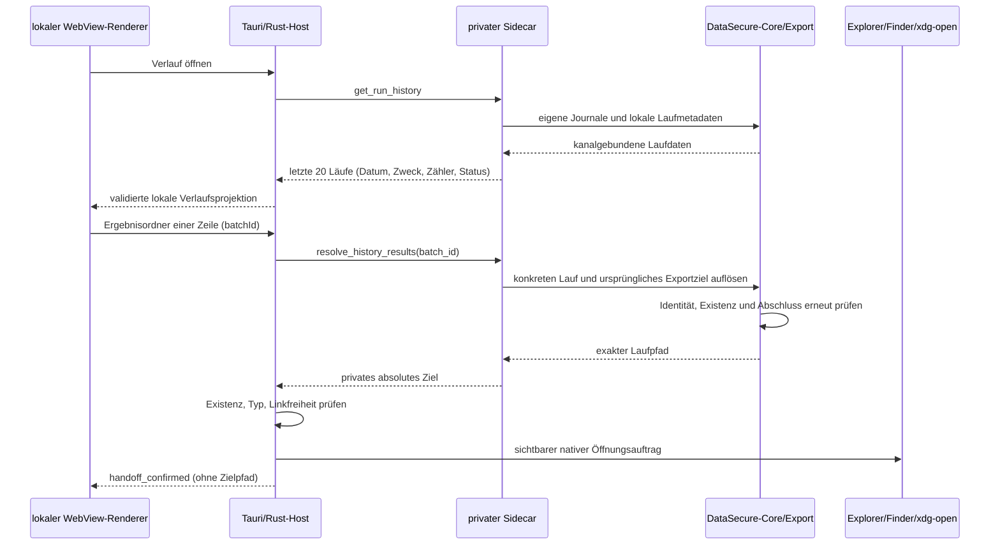

DS-086 trennt **Navigation** und **Verarbeitungszustand**. Start öffnet immer
die Startseite, die Betriebsart ist zunächst leer. Weder Abschluss noch
wiederhergestellte Auswahl wechseln automatisch die Ansicht. Der Verlauf
enthält höchstens 20 Zeilen, neueste zuerst; die Daten werden dadurch nicht
gelöscht. Historienaktionen verwenden nur die konkrete Laufkennung. Fortsetzung
prüft erneut Journal, gespeicherten Zweck und die Sperre für einen aktiven
Stapel; ein nicht mehr fortsetzbarer Eintrag startet niemals einen anderen Lauf.
